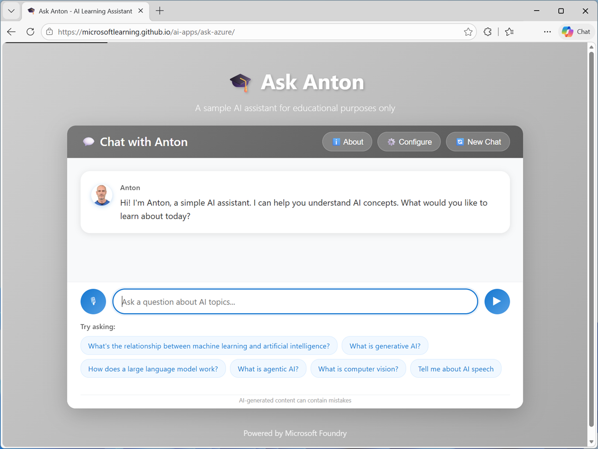
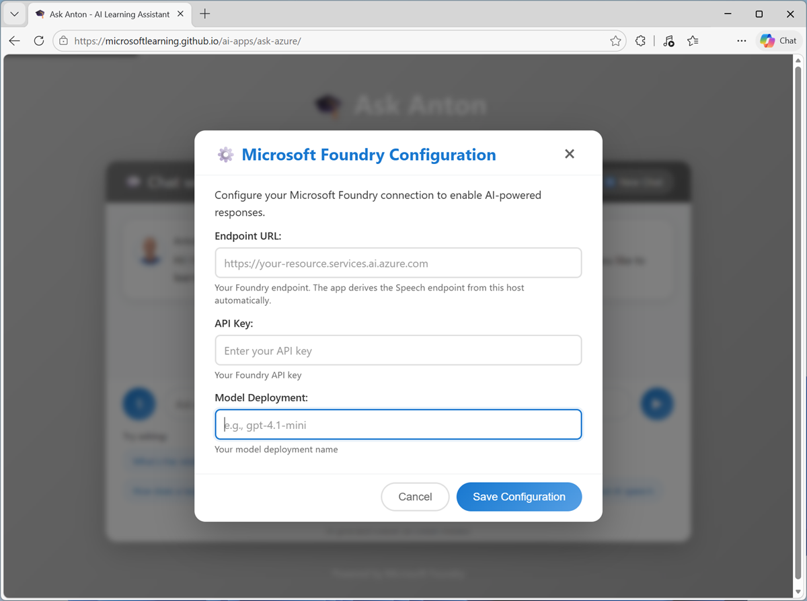

---
lab:
  title: Microsoft Foundry の概要
  description: Microsoft Foundry プロジェクトを作成して調べます。
  level: 200
  duration: 30 minutes
  islab: true
  primarytopics:
    - Microsoft Foundry
---

# Microsoft Foundry の概要

この演習では、Microsoft Foundry プロジェクトを作成して調べます。

この演習の所要時間は約 **30** 分です。

> **注**: Microsoft Foundry ポータルなど、Microsoft Foundry の多くのコンポーネントは、継続的に開発が進められています。 これは、人工知能テクノロジの急速な進歩を反映したものです。 実際のユーザー エクスペリエンスは、この演習で使用されている画像や説明と異なる場合があります。

## Microsoft Foundry プロジェクトを作成する

Microsoft Foundry では、AI ソリューションの開発に使われるモデル、リソース、データ、その他の資産を整理するために "プロジェクト" を使います。** プロジェクトは Azure *Microsoft Foundry* リソースに関連付けられており、これは Azure での AI アプリとエージェントの開発をサポートするために必要なクラウド サービスを提供します。

1. Web ブラウザーで [Microsoft Foundry](https://ai.azure.com){:target="_blank"} (`https://ai.azure.com`) を開き、Azure の資格情報を使ってサインインします。 初めてサインインすると開くヒントやクイック スタートのペインをすべて閉じ、必要な場合は、左上にある **Foundry** のロゴを使ってホーム ページに移動します。

1. まだ有効になっていない場合は、ページ上部のツール バーで **[新しい Foundry]** オプションを有効にします。 次に、新しいプロジェクトを作成するための画面が表示された場合は、一意の名前を指定して作成します。このときに **[高度なオプション]** 領域を展開して、プロジェクトの設定を次のとおりに指定します。
    - **Foundry リソース**: *AI Foundry リソースに有効な名前を入力します。*
    - **[サブスクリプション]**:"*ご自身の Azure サブスクリプション*"
    - **リソース グループ**: *リソース グループを作成または選択します*
    - **[リージョン]**: **[AI Foundry 推奨]** のリージョンのいずれかを選択します。

1. **［作成］** を選択します プロジェクトが作成されるまで待ちます。 これには数分かかることがあります。 新しい Foundry ポータルでプロジェクトを作成または選択すると、それが次の画像のようなページで開かれます。

    

## Microsoft Foundry 用の Azure リソースを確認する

Microsoft Foundry プロジェクトは、Azure サブスクリプション内のリソースに基づいています。 それでは、これについて見ていきましょう。

1. プロジェクトのホーム ページの左上にあるツール バーで、プロジェクト名を選びます。 次に、結果のメニューで **[すべてのプロジェクトを表示]** を選び、自分がアクセス権を持つすべてのプロジェクトを表示します (1 つだけの場合もあります)

    ![[すべてのプロジェクト] ページのスクリーンショット。](./media/0-all-projects.png)

    各プロジェクトには "親" リソースがあり、そのサービスと構成を複数の子プロジェクトに適用できます。**

1. プロジェクトの親リソースの名前を記録しておきます。 次に、新しいブラウザー タブを開いて [Azure portal](https://portal.azure.com){:target="_blank"} (`https://portal.azure.com`) に移動し、プロンプトが表示された場合は Azure の資格情報を使ってサインインします。
1. Azure portal のホーム ページの上部にある検索ボックスで、Microsoft Foundry 親リソースを検索します。

    

1. 親リソース名と一致する **Foundry** リソースを選んで開きます。
1. Foundry リソースのページで **[リソース ビジュアライザー]** ページを表示して、リソースとその子プロジェクトの間の関係を確認します。

    

1. このリソースで作成した子プロジェクトを選び、Azure portal でそのページを開きます。

    

    AI プロジェクトを開発および管理するためのほとんどのタスクは Microsoft Foundry ポータルで実行できますが、プロジェクトとそれが使用するサービスが Microsoft Azure のリソースとして実装されることを理解しておくことが重要です。それらは、企業のガバナンスとセキュリティ ポリシーの対象となる可能性があります。

1. Azure portalを含むブラウザー タブを閉じて、Microsoft Foundry ポータルに戻ります。 その後、**[すべてのプロジェクト]** ページ ヘッダーの横にある "戻る矢印" アイコンを使って、プロジェクトのホーム ページに戻ります。

## Microsoft Foundry ポータルを調べる

Microsoft Foundry ポータルでは、アプリケーション用のエージェントと AI サービスの作成と管理を行います。

> **注**:Microsoft Foundry ポータルは、継続的に改善と拡張が行われます。 この演習で示すインターフェイスは、お使いのポータルのインターフェイスと完全には一致しない場合があります。

1. プロジェクトの **ホーム** ページを表示します。

    

    プロジェクトには "API キー"、"プロジェクト エンドポイント"、"Azure OpenAI エンドポイント" があり、これらを使って、クライアント アプリケーションからプロジェクト内のモデル、エージェント、その他の資産に安全にアクセスできます。******

    > **ヒント**: 後でプロジェクト キーとプロジェクト エンドポイントが必要になります。

1. **[検出]** ページを表示します。

    ![[検出] ページのスクリーンショット。](./media/0-discover.png)

    このページには最新のモデルとサービスが表示され、ユーザーは AI アプリケーション開発の出発点を見つけることができます。

1. **[ビルド]** ページを表示します。

    ![[ビルド] ページのスクリーンショット。](./media/0-build.png)

    このページで AI ソリューションを開発します。 ここでは次を実行できます。

    - プロジェクトの "エージェント" と "ワークフロー" を表示して管理します。****
    - プロジェクトの "モデル" を表示して管理します。**
    - アプリケーションの特定のニーズに基づいてクエリに応答するように基本モデルを "微調整" します。**
    - エージェントがタスクの実行に使用できる "ツール" を追加して構成します。**
    - 企業の Foundry IQ データ ソースに基づいてエージェント用の "ナレッジ" を管理します。**
    - AI エージェントと生成 AI アプリ用の "データ" インデックスを接続して管理します。**
    - モデルのパフォーマンスを比較するための "評価" を作成します。**
    - 生成 AI のコンテンツと動作に対する責任ある AI ポリシーに確実に準拠させるための "ガードレール" を定義して管理します。**
1. **[	運用]** ページを表示します。

    ![[運用] ページのスクリーンショット。](./media/0-operate.png)

     このページでは、次の方法で AI ソリューションを運用できます。

    - プロジェクトのエージェント、モデル、ツールなどの "資産" を管理します。**
    - セキュリティ ポリシーを使って "コンプライアンス" を管理します。**
    - プロジェクト内のモデルや他の資産の使用に関する制限を定義する "クォータ" の構成を表示して管理します。**
    - "管理" タスクを実行してプロジェクトを管理します。**

1. **[ドキュメント]** ページを表示します。

    ![[ドキュメント] ページのスクリーンショット。](./media/0-docs.png)

    このページでは、Microsoft Foundry のドキュメントにアクセスできます。

## AI による支援を得る

最先端の AI ソリューションを開発するためのプラットフォームに期待されるように、Microsoft Foundry では AI ベースの支援が提供されます。

1. ツール バーの AI チャット アイコンを使って、**[AI に質問する]** ペインを開きます。

    ![Foundry ポータルの [AI に質問する] ペインのスクリーンショット。](./media/0-ask-ai.png)

1. `What can I do with Microsoft Foundry?` といったプロンプトを入力して、応答を確認します。

    この演習で調べてきたことについて何か疑問がある場合は、ここで尋ねてみてください。

## モデルをデプロイする

あなたの Microsoft Foundry リソースにはエンドポイントが用意されており、ここでモデルを展開してアプリケーションやエージェントから使用することができます。

1. **[検出]** ページで **[モデル]** タブを選択して Microsoft Foundry モデル カタログを表示します。

    Microsoft Foundry には、AI アプリとエージェントで使用できる、Microsoft、OpenAI、その他のプロバイダーによる豊富なモデル コレクションが用意されています。

    

1. `gpt-4.1-mini` モデルを検索して選択すると、そのモデルの特徴と機能を説明するページが表示されます。

    

1. **[デプロイ]** ボタンを使用して、既定の設定を使用してモデルをデプロイします。 デプロイには 1 分ほどかかる場合があります。

    > **ヒント**: モデルのデプロイにはリージョンのクォータが適用されます。 このモデルをプロジェクトのリージョンにデプロイするのに十分なクォータがない場合は、別のモデル (たとえば gpt-4.1-nano、または gpt-4o-mini) を使用してください。 別の方法として、新しいプロジェクトを別のリージョンに作成することもできます。

1. モデルがデプロイされると開くモデル プレイグラウンド ページを確認します。ここでモデルとチャットできます。

    

1. 自分のモデル デプロイ (名前は **gpt-4.1-mini** となっているはずです) がプレイグラウンドで選択されていることを確認します。

    > **ヒント**: モデル デプロイの名前を覚えておいてください。 この情報は後で必要になります。

1. **[チャット]** ペインで、`What is AI?` のようなメッセージを入力してモデルをテストします。

## 自分の Foundry リソース エンドポイントを使用する

Azure 内に Microsoft Foundry リソースを持つ状態になったので、そのモデルとツールをクライアント アプリケーションから使用できます。 この演習では、提供されている単純な AI チャット アプリケーションを使用します。

1. Foundry ポータルの上部にあるメニューで、**[ホーム]** を選択してホーム ページに戻ります。
1. プロジェクトに関する次の詳細情報を確認します。
    - **プロジェクト エンドポイント**: この URL でプロジェクト リソースにアクセスできます。

        Azure OpenAI エンドポイントではなく、**プロジェクト エンドポイント**を使用していることを確認しましょう。*<u></u>*

    - **プロジェクト API キー**: リソースへのアクセスに使用される認証キー。\*

    チャット アプリケーションを構成するには、これらの値が必要です。

    > \* キーベースの認証を禁止するポリシーを持つ企業または学校の Azure サブスクリプションを使用している場合は、Entra ID 認証を使用 "できます" が、テナントにアプリを登録する必要があります (グローバル管理者のアクセス許可が必要です)。** 最終手段として、代替のブラウザーベース (Azure 以外) のバージョンのアプリを [https://aka.ms/ask-anton](https://aka.ms/ask-anton) {:target="_blank"} で入手できます。

1. 2 つ目のブラウザー タブを開き、`https://aka.ms/azk-anton` にある [Ask Anton (Azure)](https://aka.ms/azk-anton){:target="_blank"} アプリに移動します。

    Ask Anton アプリは次のように表示されます。

    

1. チャット ペインのヘッダーで **[Configure]** を選択し、Foundry ポータル ホーム ページからのプロジェクトの値と自分のモデル デプロイ名を Foundry 構成設定ページに入力します。

    

1. 構成を保存します。

    > **注**:構成値のうち、API キー以外はユーザーのローカル ブラウザーに保存されます。 このアプリを閉じて再び開くと、API キーの再入力が必要になります。

1. このアプリを使って Anton とチャットし、AI の概念について質問します。 このアプリでは、Microsoft Foundry 内に展開されたあなたのモデルが使用されます。

    音声機能を使用する場合は、あなたのリソース内にある Azure Speech in Foundry tools がアプリでの音声認識と合成に使用されます。

    提供されるサンプル プロンプトから始めて、独自の質問と要求を入力しましょう。 このアプリは、概念的な AI トピックに関する情報と、Foundry 固有の情報を提供できます。 次に例を示します。

    - `Tell me about Microsoft Foundry.`

    - `Can I implement an AI speech solution using Foundry Tools?`

    - `Find me an overview of AI app development on Azure.`

    > **注**: これらのプロンプトの一部により、エージェントが Microsoft Learn ドキュメント サイトに接続する MCP ツールを使用することがあります。 MCP ツールについてご不明な点は、Anton に質問してみてください。

## まとめ

この演習では、Microsoft Foundry プロジェクトのことを調べ、Microsoft Foundry ポータルについて理解しました。 その後でモデルを展開して、あるクライアント アプリケーションを自分の Foundry リソースに接続しました。

## クリーンアップ

Microsoft Foundry について調べ終わったら、不要な利用料金が発生しないように、この演習で作成したリソースを削除する必要があります。

1. [Azure portal](https://portal.azure.com){:target="_blank"} (`https://portal.azure.com`) を開き、この演習で使ったプロジェクトをデプロイしたリソース グループの内容を表示します。
1. ツール バーの **[リソース グループの削除]** を選びます。
1. リソース グループ名を入力し、削除することを確認します。
