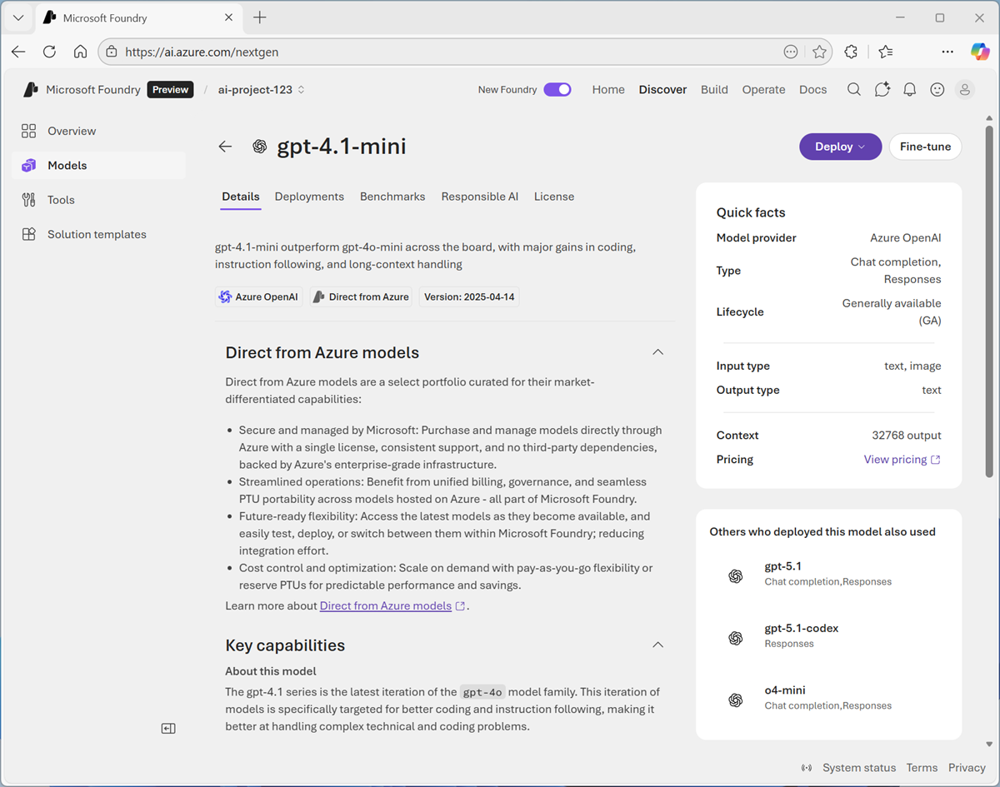
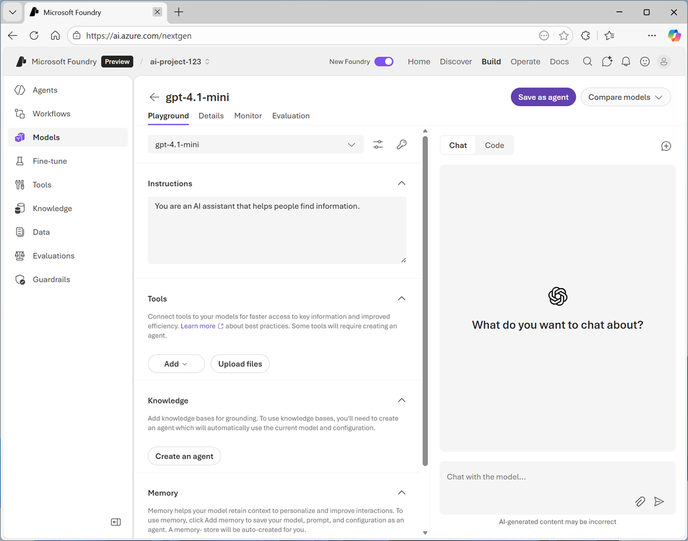
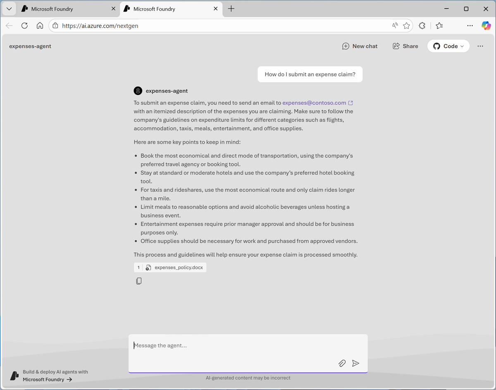
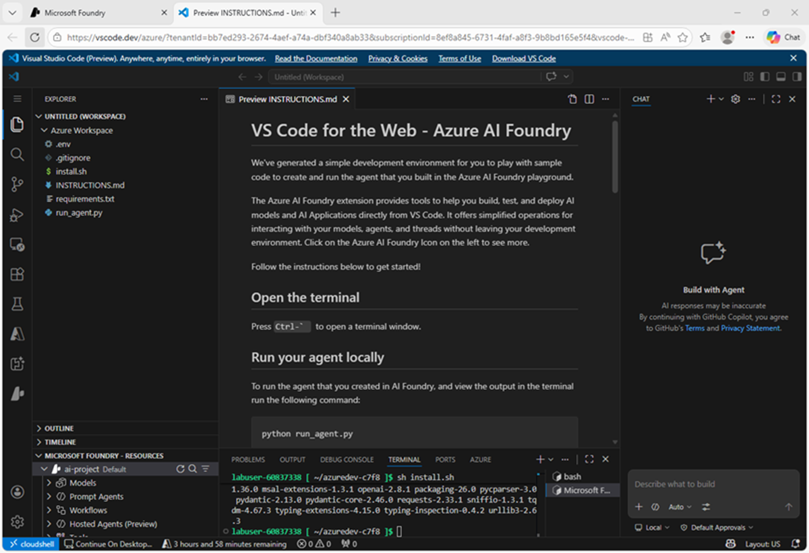
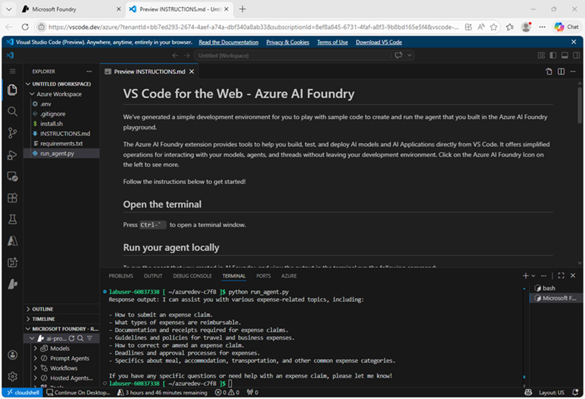

---
lab:
  title: Microsoft Foundry で生成 AI とエージェントの使用を開始する
  description: Microsoft Foundry を使用して、生成 AI モデルをデプロイし、エージェントを作成します。
  level: 200
  duration: 35 minutes
  islab: true
  primarytopics:
    - Microsoft Foundry
---

# Microsoft Foundry で生成 AI とエージェントの使用を開始する

この演習では、Microsoft Foundry を使用して、生成 AI モデルをデプロイし、確認します。 次に、ユーザーの質問に回答するナレッジ ツールを備えたエージェントでモデルを使用します。

> **注**: Microsoft Foundry ポータルなど、Microsoft Foundry の多くのコンポーネントは、継続的に開発が進められています。 これは、人工知能テクノロジの急速な進歩を反映したものです。 実際のユーザー エクスペリエンスは、この演習で使用されている画像や説明と異なる場合があります。

この演習の所要時間は約 **35** 分です。

## Microsoft Foundry プロジェクトを作成する

Microsoft Foundry では "プロジェクト" を使って、AI ソリューションの開発に使われるモデル、リソース、データ、その他の資産を整理します。**

1. Web ブラウザーで [Microsoft Foundry](https://ai.azure.com){:target="_blank"} (`https://ai.azure.com`) を開き、Azure の資格情報を使ってサインインします。 初めてサインインすると開くヒントやクイック スタートのペインをすべて閉じ、必要な場合は、左上にある **Foundry** のロゴを使ってホーム ページに移動します。

1. まだ有効になっていない場合は、ページ上部のツール バーで **[新しい Foundry]** オプションを有効にします。 次に、新しいプロジェクトを作成するための画面が表示された場合は、一意の名前を指定して作成します。このときに **[高度なオプション]** 領域を展開して、プロジェクトの設定を次のとおりに指定します。
    - **Foundry リソース**: *AI Foundry リソースに有効な名前を入力します。*
    - **[サブスクリプション]**:"*ご自身の Azure サブスクリプション*"
    - **リソース グループ**: *リソース グループを作成または選択します*
    - **[リージョン]**: **[AI Foundry 推奨]** のリージョンのいずれかを選択します。

1. **［作成］** を選択します プロジェクトが作成されるまで待ちます。 これには数分かかることがあります。 新しい Foundry ポータルでプロジェクトを作成または選択すると、それが次の画像のようなページで開かれます。

    

## モデルをデプロイする

あらゆる生成 AI アプリまたはエージェントの中心には言語モデルがあります。通常は大規模言語モデル (LLM) ですが、場合によってはよりコンパクトな小規模言語モデル (SLM) が使用されることもあります。

1. これで**ビルドを開始する**準備は完了です。 **[モデルの検索]** を選択して (または **[検出]** ページで **[モデル]** タブを選択して) Microsoft Foundry モデル カタログを表示します。

    Microsoft Foundry には、AI アプリとエージェントで使用できる、Microsoft、OpenAI、その他のプロバイダーによる豊富なモデル コレクションが用意されています。

    

1. `gpt-4.1-mini` モデルを検索して選択すると、そのモデルの特徴と機能を説明するページが表示されます。

    

1. **[デプロイ]** ボタンを使用して、既定の設定を使用してモデルをデプロイします。 デプロイには 1 分ほどかかる場合があります。

    > **ヒント**: モデルのデプロイにはリージョンのクォータが適用されます。 このモデルをプロジェクトのリージョンにデプロイするのに十分なクォータがない場合は、別のモデル (たとえば gpt-4.1-nano、または gpt-4o-mini) を使用してください。 別の方法として、新しいプロジェクトを別のリージョンに作成することもできます。

1. モデルがデプロイされると開くモデル プレイグラウンド ページを確認します。ここでモデルとチャットできます。

    

## モデルとチャットする

プレイグラウンドを使用すると、モデルとチャットし、指示 ("システム プロンプト" とも呼ばれます) やパラメーターなどの設定の変更による影響を観察して、モデルを確認することができます。**

1. 左側のナビゲーション ウィンドウの下部にあるボタンを使ってそれを非表示にし、作業するスペースを増やします。
1. **[チャット]** ペインで、`Who was Ada Lovelace?` などのプロンプトを入力し、応答を確認します。

    ![応答が表示されている [チャット] ペインのスクリーンショット。](./media/0-chat-response.png)

1. `Tell me more about her work with Charles Babbage.` などのフォローアップ プロンプトを入力し、応答を確認します。

    > **注**:多くの場合、生成 AI のチャット アプリケーションでは、プロンプトに会話履歴が含まれます。そのため、会話のコンテキストは後続のメッセージにも引き継がれます。 この場合、"her" は Ada Lovelace を指していると解釈されます。

1. チャット ペインの右上にある **[新しいチャット]** ボタンを使用して、会話を再開します。 こうすることで、すべての会話履歴は削除されます。
1. `Tell me about the ELIZA chatbot.` などの新しいプロンプトを入力し、応答を確認します。
1. `How does it compare with modern LLMs?` などのプロンプトを使用して会話を続けます。

## モデルとチャットするクライアント コードを表示する

プレイグラウンドでモデルから返された応答に満足したら、それを利用するクライアント アプリケーションを開発できます。 Microsoft Foundry には、デプロイされたモデルに接続してチャットするために使用できる REST API と複数の言語固有の SDK が用意されています。

1. **[チャット]** ペインで、**[コード]** タブを表示します。このタブには、クライアント アプリケーションがモデルとチャットするために使用できるサンプル コードが表示されます。 サンプル コードの上部で、次の設定を選択できます。
    - **API**:OpenAI API は、生成 AI モデルとの会話を実装するための一般的な標準です。 使用できる OpenAI API には 2 つのバリアントがあります。
        - **補完**:モデルにプロンプトを送信するために広く使用されているプログラム構文。
        - **応答**:スタンドアロン モデルと "エージェント" の両方と対話するアプリを構築する際に、より柔軟に対応できる新しい構文。**
    - **言語**:さまざまなプログラミング言語で、モデルを使用するコードを記述できます。具体的には、Python、 Microsoft C#、JavaScript などです。
    - **SDK**:クライアントとモデル間でやり取りされる低レベルな通信の詳細をカプセル化する各言語固有の SDK を使用することや、REST API を直接操作して、クライアントがモデルに送信する HTTP 要求メッセージを完全に制御することができます。
    - **認証**: Microsoft Foundry にデプロイされたモデルを使用するには、クライアント アプリケーションを認証する必要があります。 以下を使用して認証を実装できます。
        - **キーベースの認証**:クライアント アプリはセキュリティ キーを提示する必要があります (コード サンプルの上にあるキー アイコンを選択すると確認できます)
        - **Microsoft Entra ID 認証**:クライアント アプリは、そのアプリ (または現在のユーザー) に割り当てられている ID に基づいて認証トークンを提示します。

1. 次のコード オプションを選択します。
    - **API**:Responses API
    - **言語**: Python
    - **SDK**:OpenAI SDK
    - **認証**: キー認証

    結果のサンプルは次のコードのようになります。

    ```python
    from openai import OpenAI
    
    endpoint = "https://{your-foundry-resource}.openai.azure.com/openai/v1/"
    deployment_name = "gpt-4.1-mini"
    api_key = "<your-api-key>"
    
    client = OpenAI(
        base_url=endpoint,
        api_key=api_key
    )
    
    response = client.responses.create(
        model=deployment_name,
        input="What is the capital of France?",
    )
    
    print(f"answer: {response.output[0]}")
    ```

    コードは、シークレット認証キー (**api_key** 変数を設定するためにコードにコピーする必要があります) を使用して、Microsoft Foundry リソースの **OpenAI** エンドポイントに接続します。 次に、**responses.create** メソッドを使用して、入力プロンプト (この場合は、ハードコーディングされた質問 "What is the capital of France?") から、デプロイ済みのモデルからの応答を生成し、出力コンソールに応答を出力します。

## "システム プロンプト" で指示を指定する**

ここまでは、モデルを使用して一般的な情報を提供してきました。 特定のユース ケースをサポートするには、"システム プロンプト" を使用して応答をガイドする手順をモデルに提供する必要があります。** システム プロンプトを使用して、モデルに特定のフォーカスまたはロールを与え、モデルの応答に含める必要がある、および含めてはならない内容について、形式、スタイル、制約に関するガイドラインを提供できます。

たとえば、ある組織が生成 AI モデルを使用して、従業員の経費清算を支援する AI エージェントの使用を検討しているとします。

1. モデルのプレイグラウンドで、**[チャット]** タブに戻ります。次に、チャット ウィンドウの右上にある **[新しいチャット]** ボタンを使用して会話を再開し、会話履歴を削除します。
1. 左側のペインの **[指示]** テキスト領域で、システム プロンプトを次のように変更します:

    ```
   You are a helpful AI assistant who supports employees with expense claims. Provide concise, accurate information only on topics related to expenses. Do not provide any information about topics that are not directly related to expenses.
    ```

1. 次に、`What kinds of business expense are typically reimbursed by employers?` のように、経費清算に関連する新しいユーザー プロンプトを入力します

    経費清算に関する一般的なガイダンスを提供する必要がある応答を確認します。

1. `Tell me about the ELIZA chatbot` のような、経費に関係のない、以前に質問した質問をもう一度尋ねてみます。システム プロンプトが変更された時点で応答を比較します。

    ここまでは、手順を "プレイグラウンド" で指定しましたが、環境の外部には保存されません。** クライアント アプリケーションでは、次のように、システム プロンプトを **instructions** パラメーターとして **responses.create** メソッドに含める必要があります。

    ```python
    response = client.responses.create(
            model=deployment_name,
            instructions="""
                You are a helpful AI assistant who supports employees with expense claims.
                Provide concise, accurate information only on topics related to expenses.
                Do not provide any information about topics that are not directly related to expenses.
            """
            input="What kinds of business expense are typically reimbursed by employers?",
        )
    ```

    指示とモデルを 1 つの AI エンティティにカプセル化するには、構成を "エージェント" として保存する必要があります。**

## モデル構成をエージェントとして保存する

スタンドアロン モデルを使用して生成 AI アプリを実装することもできますが、完全にエージェント化された AI エクスペリエンスを実現するには、モデル、その指示、追加機能を提供する任意のツール構成を "エージェント" にカプセル化する必要があります。**

1. モデル プレイグラウンドの右上にある **[エージェントとして保存]** を選択します。 次に、プロンプトが表示されたら、新しいエージェントに `expenses-agent` という名前を付けます。

    エージェントが作成されると、エージェントを操作するための新しいプレイグラウンドが開きます。

    

1. 右ペインで、エージェントの定義が含まれている **[YAML]** タブを表示します。 定義には、次のように、モデル、そのパラメーター設定、指定した指示が含まれていることに注意してください。

    ```yml
    metadata:
      logo: Avatar_Default.svg
      microsoft.voice-live.enabled: "false"
    object: agent.version
    id: expenses-agent:1
    name: expenses-agent
    version: "1"
    description: ""
    created_at: 1776115196
    definition:
      kind: prompt
      model: gpt-4.1-mini
      instructions: You are a helpful AI assistant who supports employees with expense claims. Provide concise, accurate information only on topics related to expenses. Do not provide any information about topics that are not directly related to expenses.
      temperature: 1
      top_p: 1
      tools: []
    status: active
    ```

1. **[チャット]** タブに戻り、プロンプト `Who are you?` を入力します

    応答には、経費精算アドバイザーとしての役割をエージェントが "認識している" ことが示されるはずです。

1. 経費関連のプロンプトを入力します (例: `How much can I claim for a taxi?`)

    応答は一般的な内容になるでしょう。 正確ではあるものの、従業員にとって特に役立つ内容ではありません。 エージェントに会社の経費ポリシーと手順に関する知識を与える必要があります。

## エージェントにナレッジ ツールを追加する

エージェントは、タスクを実行したり情報を検索したりするために "ツール" を使用します。** 一般的な Web 検索ツールまたは単純なファイル検索ツールを使用してナレッジ ソースを提供できます。また、より包括的なエージェント ソリューションが必要な場合は、エージェントを企業内の 1 つ以上のデータ ソースに接続する *Microsoft Foundry IQ* ナレッジ ストアを作成することもできます。 この演習では、簡単なファイル検索ツールを使用します。

1. 新しいブラウザー タブを開き、**[expenses_policy.docx](https://microsoftlearning.github.io/mslearn-ai-fundamentals/data/expenses_policy.docx){:target="_blank"}** (`https://microsoftlearning.github.io/mslearn-ai-fundamentals/data/expenses_policy.docx`) を表示します。 これを使用して、エージェントが経費精算に関する質問に回答できるようになるナレッジ ソースを提供します。
1. **expenses_policy.docx** をローカル コンピューターにダウンロードします。
1. エージェント プレイグラウンドを含むタブに戻り、左ペインで、まだ展開されていない場合は **[ツール]** セクションを展開します。
1. **expenses_policy.docx** ファイルをアップロードし、既定のインデックス名で新しいインデックスを作成します。 インデックスが作成されたら、それをエージェントにアタッチします。
1. エージェント プレイグラウンドの上部にある **[保存]** ボタンを使用して、エージェントの定義を更新します。
1. 右ペインで、エージェントの定義が含まれている **[YAML]** タブを表示します。 定義には、追加したファイル検索ツールが含まれていることに注意してください (**tools** セクション内)。

    ```yml
    metadata:
      logo: Avatar_Default.svg
      description: ""
      modified_at: "1776115781"
      microsoft.voice-live.enabled: "false"
    object: agent.version
    id: expenses-agent:2
    name: expenses-agent
    version: "2"
    description: ""
    created_at: 1776115782
    definition:
      kind: prompt
      model: gpt-4.1-mini
      instructions: You are a helpful AI assistant who supports employees with expense claims. Provide concise, accurate information only on topics related to expenses. Do not provide any information about topics that are not directly related to expenses.
      temperature: 1
      top_p: 1
      tools:
        - type: file_search
          vector_store_ids:
            - vs_tmwFZKmfVB3rZJoeaJAcgdy9
    status: active
    ```

1. **[チャット]** タブに戻り、前と同じ経費関連のプロンプト (たとえば、`How much can I claim for a taxi?`) を入力して応答を表示します。

    今回は、経費データ ソースの情報に基づいた応答が表示されるはずです。

1. `What about a hotel?` や `Can I claim the cost of my dinner?` など、経費関連のプロンプトをいくつか試してみてください

    お疲れさまでした。 必要なナレッジにアクセスできる作業エージェントがあります。

## エージェントをプレビューする

これで作業エージェントが作成されたので、基本的な Web チャット アプリケーションでプレビューできます。

1. Foundry ポータルのエージェント プレイグラウンドで、チャット ペインの上部にある **[プレビュー]** ドロップダウン リストから **[エージェントのプレビュー]** を選択します。

    プレビュー チャット インターフェイスが新しいブラウザー タブで開きます。

1. `How do I submit an expense claim?` などの新しいプロンプトを入力し、エージェントからの応答を表示します。

    

## プロジェクト内のエージェントにアクセスするためのクライアント コードを表示する

エージェントは Foundry プロジェクト内で定義されており、それに接続するアプリを開発する便利な方法があります。エージェントとクライアント アプリの両方を繰り返し調整して、必要なソリューションを作成できます。

1. エージェントのプレイグラウンドで、**[チャット]** タブから **[コード]** タブに切り替え、エージェントを使用するためのサンプル コードを表示します。次のようになります。

    ```python
    # Before running the sample:
    # pip install azure-ai-projects>=2.0.0
    
    from azure.identity import DefaultAzureCredential
    from azure.ai.projects import AIProjectClient
    
    my_endpoint = "https://{your-foundry-resource}}.services.ai.azure.com/api/projects/{your-project}"
    
    project_client = AIProjectClient(
        endpoint=my_endpoint,
        credential=DefaultAzureCredential(),
    )
    
    my_agent = "expenses-agent"
    my_version = "2"
    
    openai_client = project_client.get_openai_client()
    
    # Reference the agent to get a response
    
    response = openai_client.responses.create(
        input=[{"role": "user", "content": "Tell me what you can help with."}],
        extra_body={"agent_reference": {"name": my_agent, "version": my_version, "type": "agent_reference"}},
    )
    
    print(f"Response output: {response.output_text}")
    ```

    エージェントに接続するコードでは、**Azure.AI.Projects** ライブラリを使用して、Foundry プロジェクトに接続された **AIProjectClient** オブジェクトを作成します。 これには特権リソースを含むプロジェクトへの接続が含まれる可能性があるため、キーベースの認証は <u>サポートされておらず</u> アプリケーションで認証するには Entra ID を使用する必要があります。

    プロジェクトに接続した後、コードはプロジェクト クライアントの **get_openai_client** メソッドを使用して OpenAI クライアント オブジェクトを取得します。これにより、前にモデルとのチャットに使用されていたのと同じ、**Responses** API を使用してエージェントにプロンプトを送信できます。 プロジェクトには複数のエージェントとモデルを含めることができるため、個別のエージェントの詳細は、**responses.create** メソッドで **extra_body** として指定されます。

1. **[コード]** タブで、**[Web 用 VS Code で開く]** ボタンを使用して、新しいブラウザー タブで Web 用の Visual Studio Code を開きます。

    環境が設定されるまで待ちます。

    > **ヒント**: 環境が設定されるまでに数分かかる場合があります。

    

1. Web 用 VS Code が開き、環境が設定されたら、右側にある GitHub Copilot **Chat** ペインを閉じるとより広い領域を使用できます。また、**Instructions.md** ファイルには、サンプル コードを実行するために必要な手順が含まれていることに注意してください (これは、左側の VS Code エクスプローラー ペインの **run_agent.py** ファイルにあります)。
1. 下部のターミナル ペインで次のコマンドを入力してコードを実行します。

    ```python
   python run_agent.py
    ```

    出力には、プロンプト "実行したい作業を入力してください..." への応答が含まれているはずです。**

    

    > **ヒント**: 認証の問題が発生した場合は、Azure CLI `az login` コマンドを使用して VS Code ターミナルで Azure へのサインインが必要になることがあります。 詳細については、[Azure CLI のドキュメント](https://learn.microsoft.com/cli/azure/authenticate-azure-cli-interactively){:target="_blank"} を参照してください。

    Visual Studio Code で Azure AI Projects SDK と Foundry を統合すると、開発者は効果的なエージェント ソリューションを迅速かつ効率的に構築できます。

## まとめ

この演習では、Microsoft Foundry ポータルで生成 AI モデルを使用してチャットをデプロイする方法について説明しました。 その後、エージェントをアプリケーションに統合するためのオプションを調べる前に、モデルをエージェントとして保存し、指示とツールを使用してエージェントを構成しました。

この演習で確認したエージェントは、Microsoft Foundry を使用すると生成 AI アプリとエージェントの開発をいかに迅速かつ簡単に開始できるかを示す簡単な例です。 この基盤から、エージェントがツールを使用して情報を検索し、タスクを自動化し、相互に連携して複雑なワークフローを実行する、包括的なエージェント ソリューションを構築できます。

## クリーンアップ

Microsoft Foundry について調べ終わったら、不要な利用料金が発生しないように、この演習で作成したリソースを削除する必要があります。

1. [Azure portal](https://portal.azure.com){:target="_blank"} (`https://portal.azure.com`) を開き、この演習で使ったプロジェクトをデプロイしたリソース グループの内容を表示します。
1. ツール バーの **[リソース グループの削除]** を選びます。
1. リソース グループ名を入力し、削除することを確認します。
<!--
> **Tip**: If you want to keep the Foundry project, but avoid being charged for the published agent, use the **&vellip;** menu next to the **Publish** drop-down list to delete the agent.
-->
