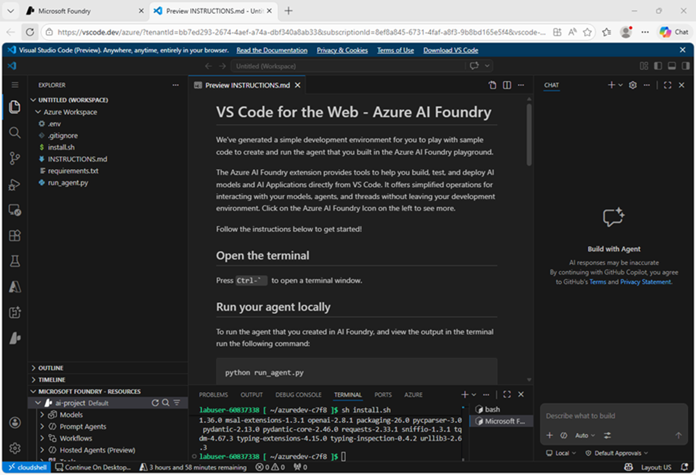
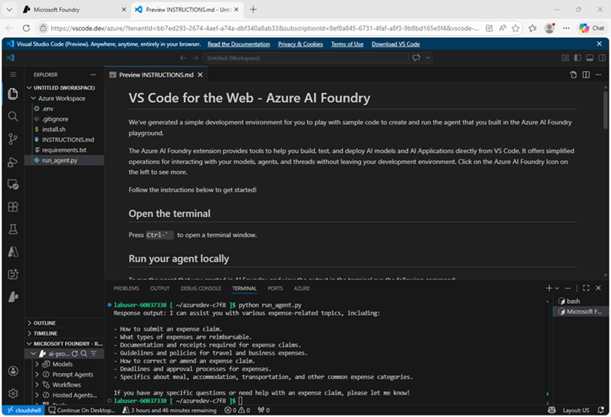

---
lab:
  title: Microsoft Foundry で生成 AI とエージェントの使用を開始する
  description: Microsoft Foundry を使用して、生成 AI モデルをデプロイし、エージェントを作成します。
  level: 200
  duration: 35 minutes
  islab: true
  primarytopics:
    - Microsoft Foundry
---

# Microsoft Foundry で生成 AI とエージェントの使用を開始する

この演習では、Microsoft Foundry を使用して、生成 AI モデルを展開して探索し、経費申請に関する一般的な質問に回答します。 次に、特定の経費関連の質問に回答するナレッジ ツールを備えたエージェントでモデルを使用します。

> **注**: Microsoft Foundry ポータルなど、Microsoft Foundry の多くのコンポーネントは、継続的に開発が進められています。 これは、人工知能テクノロジの急速な進歩を反映したものです。 実際のユーザー エクスペリエンスは、この演習で使用されている画像や説明と異なる場合があります。

この演習の所要時間は約 **35** 分です。

## Microsoft Foundry プロジェクトを作成する

Microsoft Foundry では "プロジェクト" を使って、AI ソリューションの開発に使われるモデル、リソース、データ、その他の資産を整理します。**

1. Web ブラウザーで [Microsoft Foundry](https://ai.azure.com){:target="_blank"} (`https://ai.azure.com`) を開いてビルドを開始します。Azure の資格情報を使ってサインインします。

1. まだ有効になっていない場合は、ページ上部のツール バーで **[新しい Foundry]** オプションを有効にします。 次に、新しいプロジェクトを作成するための画面が表示された場合は、一意の名前を指定して作成します。このときに **[高度なオプション]** 領域を展開して、プロジェクトの設定を次のとおりに指定します。
    - **Foundry リソース**: *AI Foundry リソースに有効な名前を入力します。*
    - **[サブスクリプション]**:"*ご自身の Azure サブスクリプション*"
    - **リソース グループ**: *リソース グループを作成または選択します*
    - **リージョン**: **[こちらの一覧](https://learn.microsoft.com/azure/foundry/openai/how-to/responses#region-availability)**{:target="_blank"}にある、**AI Foundry の推奨**リージョンのいずれかを選択します

    > **注**: Azure サブスクリプションのアクセス許可によっては、推奨されるリソースを設定するオプションをオフにする必要がある場合があります。

1. **［作成］** を選択します プロジェクトが作成されるまで待ちます。 これには数分かかることがあります。 "新しい" Foundry ポータルでプロジェクトを作成または選択すると、それが次の画像のようなページで開かれます。

    

## モデルをデプロイする

あらゆる生成 AI アプリまたはエージェントの中心には言語モデルがあります。通常は大規模言語モデル (LLM) ですが、場合によってはよりコンパクトな小規模言語モデル (SLM) が使用されることもあります。

1. これで、モデルを探索する準備ができました。 **[検出]** ページで **[モデル]** タブを選択して Microsoft Foundry モデル カタログを表示します。

    Microsoft Foundry には、AI アプリとエージェントで使用できる、Microsoft、OpenAI、その他のプロバイダーによる豊富なモデル コレクションが用意されています。

    

1. `gpt-5-mini` モデルを検索して選択すると、そのモデルの特徴と機能を説明するページが表示されます。

    

1. **[デプロイ]** ボタンを使用して、既定の設定を使用してモデルをデプロイします。 デプロイには 1 分ほどかかる場合があります。

    > **ヒント**: モデルのデプロイにはリージョンのクォータが適用されます。 このモデルをプロジェクトの Azure リージョンにデプロイするのに十分なクォータがない場合は、別のチャット可能な *gpt* モデル (gpt-5 や gpt-5.1 など) をお使いください。 別の方法として、新しいプロジェクトを別のリージョンに作成することもできます。

1. モデルがデプロイされると開くモデル プレイグラウンド ページを確認します。ここでモデルとチャットできます。

    

## モデルとチャットする

プレイグラウンドを使用すると、モデルとチャットし、指示 ("システム プロンプト" とも呼ばれます) やパラメーターなどの設定の変更による影響を観察して、モデルを確認することができます。**

1. 左側のナビゲーション ウィンドウの下部にあるボタンを使ってそれを非表示にし、作業するスペースを増やします。
1. **[チャット]** ペインで、`In the context of a business, what is expense management?` などのプロンプトを入力し、応答を確認します。

    ![応答が表示されている [チャット] ペインのスクリーンショット。](./media/chat-response.png)

1. `Tell me about per-diem allowances.` などの新しいプロンプトを入力し、応答を確認します。
1. `How are they reimbursed?` などの別のプロンプトを使用して会話を続けます。

    > **注**:多くの場合、生成 AI のチャット アプリケーションでは、プロンプトに会話履歴が含まれます。そのため、会話のコンテキストは後続のメッセージにも引き継がれます。 この場合、"her" は Ada Lovelace を指していると解釈されます。

## モデルとチャットするクライアント コードを表示する

プレイグラウンドでモデルから返された応答に満足したら、それを利用するクライアント アプリケーションを開発できます。 Microsoft Foundry には、デプロイされたモデルに接続してチャットするために使用できる REST API と複数の言語固有の SDK が用意されています。

1. **[チャット]** ペインで、**[モデルの呼び出し]** タブを表示します。このタブには、クライアント アプリケーションがモデルとチャットするために使用できるサンプル コードが表示されます。 サンプル コードの上で、プログラミング言語 (例: Python、JavaScript、C# など) や認証方法 (キーベースまたは Microsoft Entra ID) に関するユーザー設定を選択できます。

1. 次のコード オプションを選びます。
    - **言語**: Python
    - **認証**: キー認証

    結果のサンプルは次のコードのようになります。

    ```python
   from openai import OpenAI

   endpoint = "<https://ai-resrce.services.ai.azure.com/openai/v1>"
   deployment_name = "gpt-5-mini"
   api_key = "<your-api-key>"
    
   client = OpenAI(
        base_url=endpoint,
        api_key=api_key
   )
    
   response = client.responses.create(
        model=deployment_name,
        input="What is the capital of France?",
   )
    
   print(f"answer: {response.output[0]}")
    ```

    コードは、シークレット認証キー (**api_key** 変数を設定するためにコードにコピーする必要があります) を使用して、Microsoft Foundry リソースの **OpenAI** エンドポイントに接続します。 次に、**responses.create** メソッドを使用して、入力プロンプト (この場合は、ハードコーディングされた質問 "What is the capital of France?") から、デプロイ済みのモデルからの応答を生成し、出力コンソールに応答を出力します。

## "システム プロンプト" で指示を指定する**

ここまでは、モデルを使用して一般的な情報を提供してきました。 特定のユース ケースをサポートするには、"システム プロンプト" を使用して応答をガイドする手順をモデルに提供する必要があります。** システム プロンプトを使用して、モデルに特定のフォーカスまたはロールを与え、モデルの応答に含める必要がある、および含めてはならない内容について、形式、スタイル、制約に関するガイドラインを提供できます。

たとえば、ある組織が生成 AI モデルを使用して、従業員の経費清算を支援する AI エージェントの使用を検討しているとします。

1. モデルのプレイグラウンドで、**[チャット]** タブに戻ります。次に、チャット ペインの右上にある **[新しいチャット]** ボタンを使用して会話を再開し、会話履歴を削除します。
1. 左側のペインの **[指示]** テキスト領域で、システム プロンプトを次のように変更します:

    ```
   You are a helpful AI assistant who supports employees with expense claims. Provide concise, accurate information only on topics related to expenses. Do not provide any information about topics that are not directly related to expenses.
    ```

1. 次に、`What's a purchasing card?` のように、経費清算に関連する新しいユーザー プロンプトを入力します

    経費清算に関する一般的なガイダンスを提供する必要がある応答を確認します。

1. `What's the capital of Spain?` のような、経費に関係のない質問を試し、システム プロンプトが変更された時点で応答を比較します。

    ここまでは、手順を "プレイグラウンド" で指定しましたが、環境の外部には保存されません。** クライアント アプリケーションでは、次のように、システム プロンプトを **instructions** パラメーターとして **responses.create** メソッドに含める必要があります。

    ```python
    response = client.responses.create(
            model=deployment_name,
            instructions="""
                You are a helpful AI assistant who supports employees with expense claims.
                Provide concise, accurate information only on topics related to expenses.
                Do not provide any information about topics that are not directly related to expenses.
            """
            input="What kinds of business expense are typically reimbursed by employers?",
        )
    ```

    指示とモデルを 1 つの AI エンティティにカプセル化するには、構成を "エージェント" として保存する必要があります。**

## モデル構成をエージェントとして保存する

スタンドアロン モデルを使用して生成 AI アプリを実装することもできますが、完全にエージェント化された AI エクスペリエンスを実現するには、モデル、その指示、追加機能を提供する任意のツール構成を "エージェント" にカプセル化する必要があります。**

1. モデル プレイグラウンドの右上にある **[エージェントとして保存]** を選択します。 次に、プロンプトが表示されたら、新しいエージェントに `expense-agent` という名前を付けます。

    エージェントが作成されると、エージェントを操作するための新しいプレイグラウンドが開きます。

    

1. **[チャット]** タブにプロンプト `Who are you?` を入力します

    応答には、経費精算アドバイザーとしての役割をエージェントが "認識している" ことが示されるはずです。

1. 経費関連のプロンプトを入力します (例: `How much can I claim for a taxi?`)

    回答は、モデルが訓練されたデータに基づいた一般的なものになる可能性が高いです。 正確ではあるものの、従業員にとって特に役立つ内容ではありません。 エージェントに会社の経費ポリシーと手順に関する知識を与える必要があります。

## エージェントにツールを追加する

エージェントは、タスクを実行したり情報を検索したりするために "ツール" を使用します。** 一般的な Web 検索ツールまたは単純なファイル検索ツールを使用してナレッジ ソースを提供できます。また、より包括的なエージェント ソリューションが必要な場合は、エージェントを企業内の 1 つ以上のデータ ソースに接続する *Microsoft Foundry IQ* ナレッジ ストアを作成することもできます。

1. エージェント プレイグラウンドの左側のペインで、**[ツール]** セクションがまだ展開されていない場合は展開します。

    モデルをエージェントとして保存した際、Microsoft Foundry が自動的に **Web 検索**ツールを追加している可能性があります。

    > **ヒント**: そうでない場合は、**[ツール]** ドロップダウン リストにこれを追加して、上部の **[保存]** ボタンを使用して変更をエージェントに保存できます。

1. [チャット] ペインで、「`Find me a credit card that's good for business expenses`」というプロンプトを入力し、応答を確認します。

    エージェントは *Web 検索*ツールを使用してインターネット上の最新のクレジット カード取引を探すはずです。

Web 検索ツールは、公共のインターネット上の一般的な情報を見つけるのに最適です。しかし、私たちはエージェントが企業の経費ポリシーのドキュメントから情報を入手できるようにする必要があります。

1. 新しいブラウザー タブを開き、**[expenses_policy.docx](https://microsoftlearning.github.io/mslearn-ai-fundamentals/data/expenses_policy.docx){:target="_blank"}** (`https://microsoftlearning.github.io/mslearn-ai-fundamentals/data/expenses_policy.docx`) を表示します。 これを使用して、エージェントが経費精算に関する質問に回答できるようになるナレッジ ソースを提供します。
1. **expenses_policy.docx** をローカル コンピューターにダウンロードします。
1. エージェント プレイグラウンドを含むタブに戻り、左側のペインの **[ツール]** セクションで **expenses_policy.docx** ファイルをアップロードし、既定のインデックス名で新しいインデックスを作成します。 インデックスが作成されたら、それをエージェントにアタッチします。
1. エージェント プレイグラウンドの上部にある **[保存]** ボタンを使用して、エージェントの定義を更新します。
1. **[チャット]** タブで、前と同じ経費関連のプロンプト (たとえば、`How much can I claim for a taxi?`) を入力して応答を表示します。

    今回は、経費データ ソースの情報に基づいた応答が表示されるはずです。

1. `What about a hotel?` や `Can I claim the cost of my dinner?` など、経費関連のプロンプトをいくつか試してみてください

    エージェントにツールが無事に追加されたので、従業員からの経費の問い合わせをサポートするために必要な指示や機能がまとめられました。

1. 右ペインで、エージェントの定義が含まれている **[YAML]** タブを表示します。 その定義に、システム プロンプトで設定した指示や、追加した Web 検索およびファイル検索のツール (**[ツール]** セクション内) が含まれています。

    ```yml
    metadata:
      logo: Avatar_Default.svg
      description: ""
      modified_at: "1782426769"
      microsoft.voice-live.enabled: "false"
    object: agent.version
    id: expense-agent:2
    name: expense-agent
    version: "2"
    description: ""
    created_at: 1782426769
    definition:
      kind: prompt
      model: gpt-5-mini
      instructions: You are a helpful AI assistant who supports employees with expense claims. Provide concise, accurate information only on topics related to expenses. Do not provide any information about topics that are not directly related to expenses.
      temperature: 1
      top_p: 1
      tools:
        - type: web_search
        - type: file_search
          vector_store_ids:
            - vs_erRFXnYdFNlXyK0RHJjn11uL
    status: active
    instance_identity:
      principal_id: 44acce74-8425-4e5c-8752-f5e96874eeb4
      client_id: 44acce74-8425-4e5c-8752-f5e96874eeb4
    blueprint:
      principal_id: f5630a7b-af07-4bcd-af2e-5cae44a09a1a
      client_id: 4b423d44-9d0c-4850-8d7c-a72a8e688d14
    blueprint_reference:
      type: ManagedAgentIdentityBlueprint
      blueprint_id: expenses-agent-ff8f8
    agent_guid: ff8f8a8a-0fa8-4d30-a715-d6e9588ed9f2
    ```

## エージェントをプレビューする

これで作業エージェントが作成されたので、基本的な Web チャット アプリケーションでプレビューできます。

1. Foundry ポータルのエージェント プレイグラウンドで、チャット ペインの上部にある **[プレビュー]** ドロップダウン リストから **[Web アプリのプレビュー]** を選択します。

    プレビュー チャット インターフェイスが新しいブラウザー タブで開きます。

1. `How do I submit an expense claim?` などの新しいプロンプトを入力し、エージェントからの応答を表示します。

    

## プロジェクト内のエージェントにアクセスするためのクライアント コードを表示する

エージェントは Foundry プロジェクト内で定義されており、それに接続するアプリを開発する便利な方法があります。エージェントとクライアント アプリの両方を繰り返し調整して、必要なソリューションを作成できます。

1. エージェント プレイグラウンドで、**[チャット]** タブから **[エージェントの呼び出し]** タブに切り替え、エージェントを使用するためのサンプル コードを表示します。次のようになるはずです。

    ```python
    # Before running the sample:
    # pip install azure-ai-projects>=2.1.0
    
    from azure.identity import DefaultAzureCredential
    from azure.ai.projects import AIProjectClient
    
    endpoint = "<https://ai-resrce.services.ai.azure.com/api/projects/ai-project>"
    
    project_client = AIProjectClient(
        endpoint=endpoint,
        credential=DefaultAzureCredential(),
    )
    
    my_agent = "expense-agent"
    my_version = "2"
    
    openai_client = project_client.get_openai_client()
    
    # Reference the agent to get a response
    
    response = openai_client.responses.create(
        input=[{"role": "user", "content": "Tell me what you can help with."}],
        extra_body={"agent_reference": {"name": my_agent, "version": my_version, "type": "agent_reference"}},
    )
    
    print(f"Response output: {response.output_text}")
    ```

    エージェントに接続するコードでは、**Azure.AI.Projects** ライブラリを使用して、Foundry プロジェクトに接続された **AIProjectClient** オブジェクトを作成します。 これには特権リソースが含まれている可能性があるプロジェクトへの接続が含まれているため、キーベースの認証はサポート<u>されておらず</u>、アプリケーションで認証するには Entra ID を使用する必要があります。

    プロジェクトに接続した後、コードはプロジェクト クライアントの **get_openai_client** メソッドを使用して OpenAI クライアント オブジェクトを取得します。これにより、前にモデルとのチャットに使用されていたのと同じ、**Responses** API を使用してエージェントにプロンプトを送信できます。 プロジェクトには複数のエージェントとモデルを含めることができるため、個別のエージェントの詳細は、**responses.create** メソッドで **extra_body** として指定されます。

1. **[エージェントの呼び出し]** タブで、利用可能なオプションを使用して **[Web 用の VS Code]** でコーディングを開始します。

    プロンプトが表示されたら、エージェント クライアントを作成したいフォルダーの名前を入力し、環境が設定されるまで待ちます (数分かかることがあります)。

    > **ヒント**: 更新を求められたら、すべて拒否してください。

    

1. Web 用 VS Code が開き、環境が設定されたら、右側にある GitHub Copilot の **[Chat]** ペインを閉じるとより広い領域を使用できます。**Instructions.md** ファイルには、サンプル コードを実行するために必要な手順が含まれています (これは、左側の VS Code エクスプローラー ペインの **run_agent.py** ファイルにあります)。
1. 下部のターミナル ペインで次のコマンドを入力してコードを実行します。

    ```python
   python run_agent.py
    ```

    出力には、プロンプト "実行したい作業を入力してください" への応答が含まれているはずです。**

    

    > **ヒント**: 認証の問題が発生した場合は、Azure CLI `az login` コマンドを使用して VS Code ターミナルで Azure へのサインインが必要になることがあります。 詳細については、[Azure CLI のドキュメント](https://learn.microsoft.com/cli/azure/authenticate-azure-cli-interactively){:target="_blank"} を参照してください。

    Visual Studio Code で Azure AI Projects SDK と Foundry を統合すると、開発者は効果的なエージェント ソリューションを迅速かつ効率的に構築できます。

## まとめ

この演習では、Microsoft Foundry ポータルで生成 AI モデルを使用してチャットをデプロイする方法について説明しました。 その後、エージェントをアプリケーションに統合するためのオプションを調べる前に、モデルをエージェントとして保存し、指示とツールを使用してエージェントを構成しました。

この演習で確認したエージェントは、Microsoft Foundry を使用すると生成 AI アプリとエージェントの開発をいかに迅速かつ簡単に開始できるかを示す簡単な例です。 この基盤から、エージェントがツールを使用して情報を検索し、タスクを自動化し、相互に連携して複雑なワークフローを実行する、包括的なエージェント ソリューションを構築できます。

> **[Ask Anton](https://aka.ms/azk-anton){:target="_blank"}**<br/><br/>この演習で取り上げるいくつかのトピックについて疑問がある場合、*[Ask Anton](https://aka.ms/azk-anton){:target="_blank"}* は生成 AI ベースのエージェントであり、AI の概念や Microsoft Foundry について質問することができます。 **[https://aka.ms/azk-anton](https://aka.ms/azk-anton){:target="_blank"}** でアプリを開き、**[構成]** ボタンを使用して Foundry プロジェクトとモデルの詳細を入力します。<br/><br/>"Ask Anton は、サポートされる Microsoft 製品ではなく、Microsoft Learn や AI スキル ナビゲーターのコンポーネントでもありません。AI で何が可能であるかを学ぶ際に探求できる AI エージェントの一例にすぎません。"**<br/><br/>Ask Anton をお試しいただき、"そのご感想をぜひ[こちらのフォーム](https://forms.office.com/r/fC0ndfBQeK){:target="_blank"}にてお寄せください"。****

## クリーンアップ

Microsoft Foundry について調べ終わったら、不要な利用料金が発生しないように、この演習で作成したリソースを削除する必要があります。

1. [Azure portal](https://portal.azure.com){:target="_blank"} (`https://portal.azure.com`) を開き、この演習で使ったプロジェクトをデプロイしたリソース グループの内容を表示します。
1. ツール バーの **[リソース グループの削除]** を選びます。
1. リソース グループ名を入力し、削除することを確認します。
