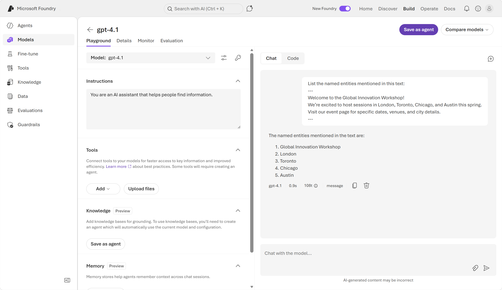
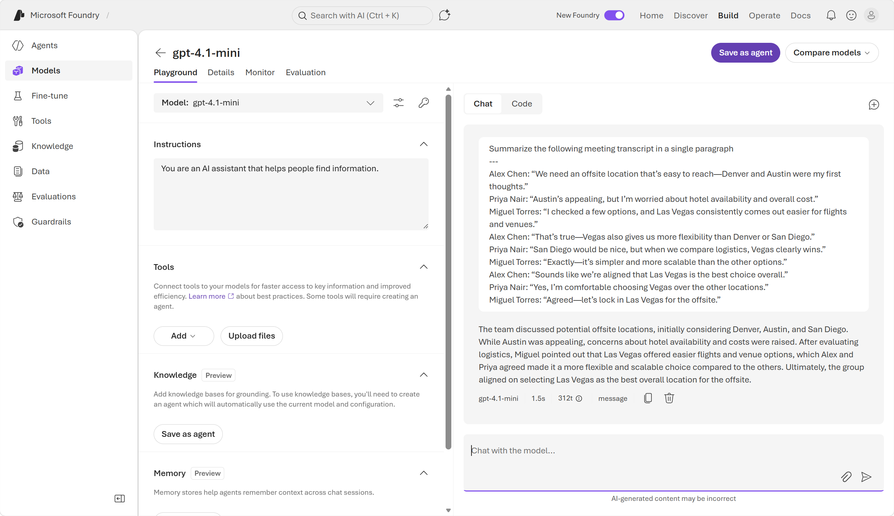
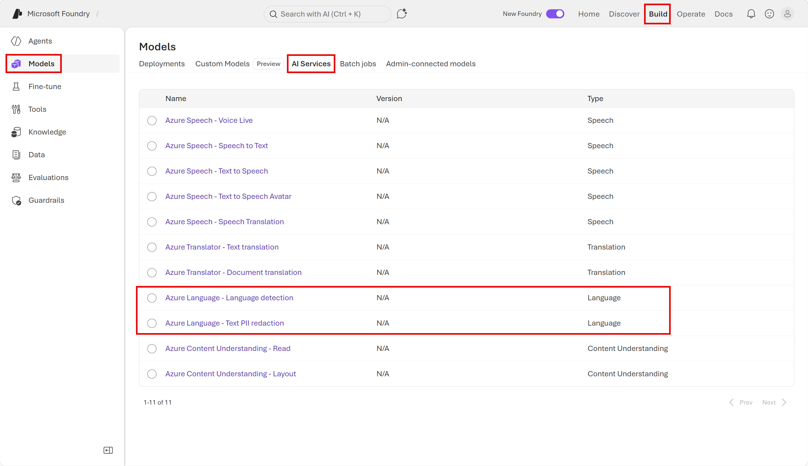

---
lab:
  title: Microsoft Foundry でテキスト分析を開始する
  description: Microsoft Foundry を使用して、さまざまな種類のテキスト分析を試します。
  primarytopics:
    - Microsoft Foundry
---

# Microsoft Foundry でテキスト分析を開始する

この演習では、Microsoft の AI アプリケーション作成用プラットフォームである **Microsoft Foundry** を使って、一般的な "テキスト分析手法" を調べます。** 

Foundry でテキストを分析するには、"2 つのアプローチ" があります。自然言語プロンプトを使って幅広いタスクを処理する**汎用 AI モデル**と、特定のタスクについての構造化された確定的な結果を返す**専用言語ツール**です。** 両方を調べると、各アプローチを使用すべきときをより明確に理解できます。

この演習の最初の部分では、"新しい" Foundry ポータルのチャット プレイグラウンドで汎用 AI モデルを使います。** この演習の 2 番目の部分では、Foundry ツールでの Azure Language の機能をいくつか調べます。 

この演習は約 **20** 分かかります。

## Microsoft Foundry でプロジェクトを作成する

1. Web ブラウザーで [Microsoft Foundry](https://ai.azure.com){:target="_blank"} (`https://ai.azure.com`) を開き、Azure の資格情報を使ってサインインします。 初めてサインインすると開くヒントやクイック スタートのペインをすべて閉じ、必要な場合は、左上にある **Foundry** のロゴを使ってホーム ページに移動します。

2. まだ有効になっていない場合は、ページ上部のツール バーで **[新しい Foundry]** オプションを有効にします。 次に、新しいプロジェクトを作成するための画面が表示された場合は、一意の名前を指定して作成します。このときに **[高度なオプション]** 領域を展開して、プロジェクトの設定を次のとおりに指定します。
    - **Foundry リソース**: *AI Foundry リソースに有効な名前を入力します。*
    - **[サブスクリプション]**:"*ご自身の Azure サブスクリプション*"
    - **リソース グループ**: *リソース グループを作成または選択します*
    - **[リージョン]**: **[AI Foundry 推奨]** のリージョンのいずれかを選択します。

3. **［作成］** を選択します プロジェクトが作成されるまで待ちます。 これには数分かかることがあります。 新しい Foundry ポータルでプロジェクトを作成または選択すると、それが次の画像のようなページで開かれます。

    

    >**注意**: プロジェクトの Foundry ホーム ページにアクセスするには、クイック スタート ペインをすべて閉じてください。 

## パート 1: 汎用 AI モデルのテキスト分析機能を調べる 

演習のこのパートでは、"新しい" Foundry ポータルと汎用言語モデルを使って、自然言語プロンプトによりテキスト分析を実行します。** 言語モデルでは、プロンプトだけでさまざまなタスクを処理できます。

1. "新しい" Foundry ポータル インターフェイスの Foundry ホーム ページで、**[ビルドの開始]** を選びます。** 次に、**[モデルの検索]** を選んで、Microsoft Foundry のモデル カタログを表示します。

    

2. `gpt-4.1` モデルを検索して選択すると、そのモデルの特徴と機能を説明するページが表示されます。

    

3. **[デプロイ]** ボタンを使い、"既定の設定" を使ってモデルをデプロイします。** デプロイが完了するまで待ちます。 デプロイが完了するとチャット プレイグラウンドに自動的に移動し、そこでモデルの機能をテストできます。 

### 感情を分析する

**感情分析**は、一般的な "自然言語処理" (NLP) タスクです。** これは、テキストが肯定的、中立的、または否定的な感情を伝えるかどうかを判断するために使用されます。レビュー、ソーシャル メディアの投稿、その他の主観的なドキュメントを分類するのに役立ちます。

1. チャット プレイグラウンドで、次のプロンプトを入力します。

    ```
    Analyze the following review, and determine whether the sentiment is positive, neutral, or negative:
    ---
    I spent several nights at the Riverside Heights Hotel during a fall trip, and the experience was outstanding from start to finish. The welcome at arrival was warm and attentive, and the staff consistently went out of their way to be helpful. The overall atmosphere made my stay smooth and relaxing, and the location was extremely convenient for getting around the city. I left with a very positive impression and would confidently recommend this hotel to others looking for a pleasant and stress‑free stay.
    ---
    ```

1. 応答を確認します。これには、テキストのセンチメントの分析が含まれているはずです。

    

1. 次のプロンプトを入力して、別のレビューを分析します。

    ```

    What about this one?
    ---
    I was disappointed with my visit to the Harbor View Inn earlier this year. The front desk process took much longer than expected, and staff responses to questions felt rushed and unhelpful. The room had ongoing maintenance issues, inconsistent internet access, and noticeable noise from the hallway throughout the night. Overall, the experience fell short of expectations, and I would not choose to stay there again.        
    ---
    ```

    独自のプロンプトを作成し、さらに実験してかまいません。 

### 名前付きエントリの抽出

**名前付きエンティティ**は、テキストで言及されている人、場所、日付、その他の重要な項目です。

1. チャット ペインの上部にある **[新しいチャット]** (&#128172;) ボタンを使って、会話を再開します。 こうすることで、すべての会話履歴は削除されます。

2. 次のプロンプトを入力して、結果を確認します。

    ```
    List the named entities mentioned in this text:
    ---
    Welcome to the Global Innovation Workshop!
    We’re excited to host sessions in London, Toronto, Chicago, and Austin this spring.
    Visit our event page for specific dates, venues, and city details.
    ---
    ```

    モデルによって、テキストで言及されている特定の場所が識別されているはずです。

    

### テキストを要約する

**[要約]** を使うと、ドキュメントの主要なポイントを、より短い文章にまとめることができます。

1. チャット ペインの上部にある **[新しいチャット]** (&#128172;) ボタンを使って、会話を再開します。 こうすることで、すべての会話履歴は削除されます。
1. 次のプロンプトを入力して、結果を確認します。

    ```

    Summarize the following meeting transcript in a single paragraph
    ---
    Jordan Lee: “We should pick a retreat location that’s convenient for most people—Chicago and Nashville came to mind first.”
    Anika Sharma: “Chicago is central, but the venue costs there can add up quickly.”
    Carlos Ramirez: “I looked into a few alternatives, and Phoenix seems much easier when it comes to flights and space.”
    Jordan Lee: “That makes sense—Phoenix does offer more flexibility than Chicago or Portland.”
    Anika Sharma: “Portland would be enjoyable, but from a planning standpoint, Phoenix is simpler.”
    Carlos Ramirez: “Exactly. It scales better and avoids some of the pricing issues.”
    Jordan Lee: “So it sounds like Phoenix is our strongest option overall.”
    Anika Sharma: “Yes, I’m comfortable choosing Phoenix over the other cities.”
    Carlos Ramirez: “Agreed—let’s move forward with Phoenix for the retreat.”
    ```

    モデルによってテキストの要約が生成されるはずです。

    

## パート 2: 特殊な言語分析ツールを使用する

多くの場合、一般的な生成 AI ワークロード用にトレーニングされた言語モデルを使って優れたテキスト分析ジョブを実行できますが、より特殊なツールをエージェントで使うと、さらに正確な予測結果を得られる場合があります。

**Foundry Tools の Azure Language** は統計的技法を使って構造化された確定的な結果を返す専用のアナライザーを備えており、自動化されたパイプラインでの一貫性のある出力に最適です。

1. "新しい" Foundry ポータルで画面上部のメニューに移動し、**[ビルド]** を選びます。** 

2. [ビルド] ページで、画面の左側にあるメニューに移動します (メニューの下部にある展開アイコンをクリックして展開することが必要な場合があります)。** 左側のメニューから、**[モデル]** を選びます。 次に、[モデル] ページの上部にある **[AI サービス]** を選びます。** 

    

### 言語を検出する

テキストが複数の言語のいずれかである可能性があるシナリオでは、多くの場合、分析ワークフローの最初のステップは、後続の処理に最適なモデルまたはエージェントにテキストをルーティングできるよう、主言語を決定することです。

1. AI サービスの一覧から、**[Azure Language - 言語検出]** アナライザーを選びます。
2. **[入力テキスト]** の一覧で、提供されているサンプル ドキュメントの 1 つを選びます。 次に、**[検出]** ボタンを使って、サンプルが記述されている言語を検出します。

    

3. 検出された言語の詳細を確認した後、**[編集]** ボタン アイコンをクリックして、入力テキストを再び編集可能にします。 次のことができるようになりました。
    - 別のサンプルを選びます。
    - 独自のテキストを入力します。
    - テキスト ファイルをアップロードする。

    たとえば、次の入力テキストを入力して、それが記述されている言語を検出します。

    ```
    ¡Hola! Me llamo Josefina y vivo en Madrid, España. Soy doctora en un hospital, ¡lo que me mantiene muy ocupada!
    ```

4. 独自の入力で実験します。 

    > **ヒント**: `https://www.bing.com/translator` にある [Bing 翻訳ツール](https://www.bing.com/translator){:target="_blank"} を使って、自分では話せない言語のテキストを生成できます。

5. 実験が終わったら、AI サービスの一覧に戻ります。 プレイグラウンド画面の上部にある [戻る] ボタンをクリックできます。

### テキスト内の PII を識別する

プライバシー ポリシーと法律を遵守するため、多くの場合、組織は名前、住所、電話番号、メール アドレス、その他の個人の詳細などの**個人を特定できる情報 (PII)** を検出してリダクトする必要があります。

1. AI サービスの一覧で、**[Azure Language - テキスト PII 抽出]** アナライザーを選びます。
2. **[入力テキスト]** の一覧で、提供されているサンプル ドキュメントの 1 つを選びます。 次に、**[検出]** ボタンを使って、テキスト内の PII の値を検出します。

    

3. 検出された PII の詳細を確認した後、**[編集]** ボタンをクリックして、入力テキストを再び編集可能にします。 次のことができるようになりました。
    - 別のサンプルを選びます。
    - 独自のテキストを入力します。
    - テキスト ファイルをアップロードする。

    たとえば、次の入力テキストを入力し、それに含まれている PII を検出します。

    ```
    Maria Garcia called from 020 7946 0958 and asked to send documents to 42 Market Road, London, UK, SW1A 1AA.
    ```

4. 独自の入力で実験します。 Azure Language では、PII の広範な一覧を認識できます。 クラスの全リストは[ここ](https://learn.microsoft.com/azure/ai-services/language-service/personally-identifiable-information/concepts/entity-categories-list)で確認できます。 そのようなエンティティの一部を次に示します。 

    - 人名
    - 電子メール アドレス
    - 電話番号
    - 番地

### サンプル コードを確認する

Foundry には、Azure Language のいくつかの機能のサンプル コードが用意されています。 サンプル コードを使って、独自のクライアント アプリケーションの作成を開始できます。 

1. 右側の **[コード]** タブを選んで、PII 識別のサンプル コードを表示します。 

    ![プレイグラウンドで開かれている [コード] タブのスクリーンショット。](./media/text-05-code.png)

>**ヒント**: 参照用に、Python での同じサンプル コードを以下に示します。 コードをコピーし、好みの Python 開発環境 (Visual Studio Code など) で実行できます。 Azure Language エンドポイントとキーの環境変数を作成する必要があります。コード サンプル ウィンドウで確認できます。

```python

    key = "paste-your-key-here"
    endpoint = "paste-your-endpoint-here"

    from azure.ai.textanalytics import TextAnalyticsClient
    from azure.core.credentials import AzureKeyCredential

    # Authenticate the client using your key and endpoint 
    def authenticate_client():
        ta_credential = AzureKeyCredential(key)
        text_analytics_client = TextAnalyticsClient(
                endpoint=endpoint, 
                credential=ta_credential)
        return text_analytics_client

    client = authenticate_client()

    # Example method for detecting sensitive information (PII) from text 
    def pii_recognition_example(client):
        documents = [
            "$documents"
        ]
        response = client.recognize_pii_entities(documents, language="en")
        result = [doc for doc in response if not doc.is_error]
        for doc in result:
            print("Redacted Text: {}".format(doc.redacted_text))
            for entity in doc.entities:
                print("Entity: {}".format(entity.text))
                print(" Category: {}".format(entity.category))
                print(" Confidence Score: {}".format(entity.confidence_score))
                print(" Offset: {}".format(entity.offset))
                print(" Length: {}".format(entity.length))
    pii_recognition_example(client)


```

## クリーンアップ

Microsoft Foundry の調査が完了したら、不要になったリソースをすべて削除します。 これにより、不要なコストが発生することを防ぎます。

1. [https://portal.azure.com](https://portal.azure.com) で **Azure portal** を開き、作成したリソースを含むリソース グループを選択します。
1. **[リソース グループの削除]** を選び、**リソース グループの名前を入力**して、確定します。 これでリソース グループが削除されます。

## 詳細情報

- [Foundry の進化](https://learn.microsoft.com/azure/foundry/what-is-foundry#evolution-of-foundry)を確認する 
- [Foundry Tools の Azure Language](https://learn.microsoft.com/azure/ai-services/language-service/overview) についての詳細を確認する
- [個人を特定できる情報 (PII) の検出](https://learn.microsoft.com/azure/ai-services/language-service/personally-identifiable-information/overview)についての詳細を確認する
