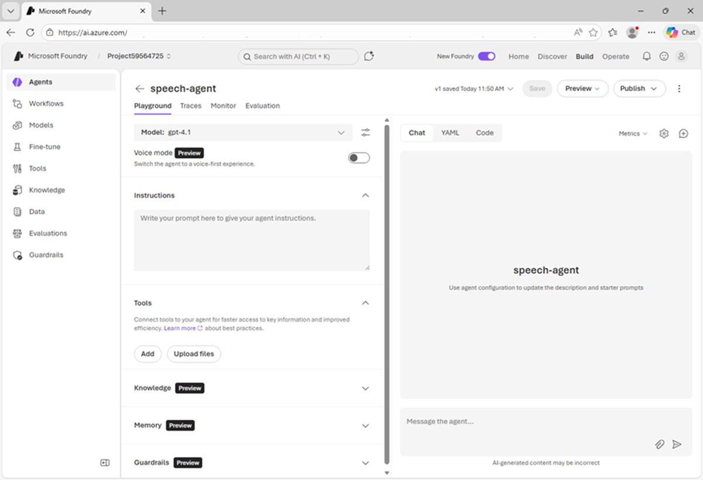

---
lab:
  title: Microsoft Foundry で音声の使用を開始する
  description: Microsoft Foundry を使用して、Azure Speech - 音声ライブを試します。
  level: 200
  duration: 25 minutes
  islab: true
  primarytopics:
    - Azure
    - Microsoft Foundry
---

# Microsoft Foundry で音声の使用を開始する

音声対応の AI エージェントを使用すると、音声応答を生成する音声コマンドと質問を使用して、ユーザーが会話的に対話できます。

この演習では、Microsoft Foundry Tools で Azure Speech を使用して、音声対応エージェントを作成します。 リアルタイムの音声ベースのエージェントを構築するために使用されるサービスである Azure Speech Voice Live を使用します。

> **ヒント**: 音声入力は静かな環境でマイクやヘッドセットを使う場合に適しています。

この演習の所要時間はおよそ **25** 分です。

## Microsoft Foundry プロジェクトを作成する

Microsoft Foundry では "プロジェクト" を使って、AI ソリューションの開発に使われるモデル、リソース、データ、その他の資産を整理します。

1. Web ブラウザーで [Microsoft Foundry](https://ai.azure.com){:target="_blank"} (`https://ai.azure.com`) を開いてビルドを開始します。Azure の資格情報を使ってサインインします。

1. まだ有効になっていない場合は、ページ上部のツール バーで **[新しい Foundry]** オプションを有効にします。 次に、新しいプロジェクトを作成するための画面が表示された場合は、一意の名前を指定して作成します。このときに **[高度なオプション]** 領域を展開して、プロジェクトの設定を次のとおりに指定します。
    - **Foundry リソース**: *AI Foundry リソースに有効な名前を入力します。*
    - **[サブスクリプション]**:"*ご自身の Azure サブスクリプション*"
    - **リソース グループ**: *リソース グループを作成または選択します*
    - **リージョン**: **[こちらの一覧](https://learn.microsoft.com/azure/foundry/openai/how-to/responses#region-availability)**{:target="_blank"}にある、**AI Foundry の推奨**リージョンのいずれかを選択します

    > **注**: Azure サブスクリプションのアクセス許可によっては、推奨されるリソースを設定するオプションをオフにする必要がある場合があります。

1. **［作成］** を選択します プロジェクトが作成されるまで待ちます。 新しい Foundry ポータルでプロジェクトを作成または選択すると、それが次の画像のようなページで開かれます。

    

## エージェントを作成する

次に、エージェントを作成しましょう。

1. **ホーム** ページの **[エージェントのビルド]** タイルで、**[ビルド開始]** を選択し (または **[ビルド]** ページで **[エージェント]** タブを選択し)、`speech-agent` という新しいエージェントを作成します。

     準備ができると、エージェントがエージェント プレイグラウンドで開きます。

    

1. モデルのドロップダウン リストで、**gpt-4.1** モデルがデプロイされ、エージェント用に選択されていることを確認します。
1. エージェントに次の**指示**を割り当てます。

    ```
   You are an AI agent that provides information about AI and related topics. You answer questions concisely and precisely.
    ```

1. **[保存]** ボタンを押して、変更を保存します。
1. **[チャット]** ペインに次のプロンプトを入力して、エージェントをテストします。

    ```
   What can you help me with?
    ```

    エージェントは、指示に基づいた適切な応答で返信する必要があります。

## Azure Speech Voice Live を構成する

Foundry エージェントの音声モードを有効にすると、Azure Speech Voice Live が統合され、エージェントに音声機能が追加されます。

1. 左側のペインのモデル選択リストで、**[音声モード]** を有効にします。

    **[構成]** ペインが自動的に開かない場合は、チャット インターフェイスの上にある "歯車" アイコンを使用して開きます。

1. **[構成]** ペインの **[音声モード]** で、既定の音声の入出力構成を確認します。 使用する音声を決定するまでプレビューして、さまざまな音声を試すことができます。
1. **[構成]** ペインを閉じ、**[保存]** ボタンを使用してエージェントを保存します。

## 音声を使用してエージェントと対話する

エージェントとチャットする準備ができました。

1. [チャット] ペインで **[セッションの開始]** ボタンを使用して、エージェントとの会話を開始します。 メッセージが表示されたら、システム マイクへのアクセスを許可します。

    エージェントが音声セッションを開始し、ユーザーのプロンプトをリッスンします。

    ![クローズド キャプションを表示する [CC] ボタンが選択されているスクリーンショット。](./media/speech-session.png)

1. アプリの状態が **Listening…** の場合は、`"How does speech recognition work?"` などと話しかけ、応答を待ちます。

1. アプリの状態が **Processing…** に変わったことを確認します。 このアプリは音声入力を処理します。

    >**ヒント**: 処理速度が非常に速く、実際には、状態が *[話し中]* に戻る前に、状態が表示されない場合があります。

1. 状態が **Speaking...** に変わると、アプリはテキスト音声変換を使用してモデルからの応答を音声化します。 元のプロンプトと応答をテキストとして表示するには、チャット画面の下部にある **[cc]** ボタンを選択します。

    >**ヒント**: 後続のプロンプトは、話すだけで送信されます。 エージェントを中断して、必要な作業に集中して操作を続けることもできます。 チャット ペインの **[生成停止]** ボタンを使用して、実行時間の長い応答を停止することもできます。 このボタンで会話が終了します。 エージェントを引き続き使用するには、新しい会話を開始する必要があります。

1. 会話を続けるには、`"How does speech synthesis work?"` のような別の質問をして、応答を確認します。
1. エージェントとのチャットが完了したら、**[X]** アイコンを使用してセッションを終了します。 会話のトランスクリプトが表示されます。

## クライアント コードを表示する

カスタム アプリケーションでエージェントを使用するには、Azure Speech Voice Live SDK を使用してストリーミング オーディオの入力と出力を処理するコードを記述する必要があります。

1. チャット画面の上部にある **[エージェントの呼び出し]** を選択すると、エージェント クライアントのサンプル コードが表示されます。
1. コードを確認します。次の処理が行われることに注目します。
    - エージェントにアクセスするためのプロジェクトへの接続。
    - 入力と出力用の音声ストリーミング。
    - マイクやスピーカーなどのオーディオ デバイスの使用。

## まとめ

この演習では、Microsoft Foundry の Azure Speech Voice Live ツールと、それを使用して会話型エージェントを構築する方法について説明しました。 Azure Speech には、音声を文字起こししたり、テキストから音声出力を生成したりする AI アプリケーションとエージェントを構築するために使用できる複数の音声機能が含まれています。

> **[Ask Anton](https://aka.ms/azk-anton){:target="_blank"}**<br/><br/>この演習で取り上げるいくつかのトピックについて疑問がある場合、*[Ask Anton](https://aka.ms/azk-anton){:target="_blank"}* は生成 AI ベースのエージェントであり、AI の概念や Microsoft Foundry について質問することができます。 **[https://aka.ms/azk-anton](https://aka.ms/azk-anton){:target="_blank"}** でアプリを開き、**[構成]** ボタンを使用して Foundry プロジェクトとモデルの詳細を入力します。<br/><br/>"Ask Anton は、サポートされる Microsoft 製品ではなく、Microsoft Learn や AI スキル ナビゲーターのコンポーネントでもありません。AI で何が可能であるかを学ぶ際に探求できる AI エージェントの一例にすぎません。"**<br/><br/>Ask Anton をお試しいただき、"そのご感想をぜひ[こちらのフォーム](https://forms.office.com/r/fC0ndfBQeK){:target="_blank"}にてお寄せください"。****

## クリーンアップ

Microsoft Foundry の調査が完了したら、不要になったリソースをすべて削除します。 これにより、不要なコストが発生することを防ぎます。

1. [https://portal.azure.com](https://portal.azure.com) で **Azure portal** を開き、作成したリソースを含むリソース グループを選択します。
1. **[リソース グループの削除]** を選び、**リソース グループの名前を入力**して、確定します。 これでリソース グループが削除されます。
