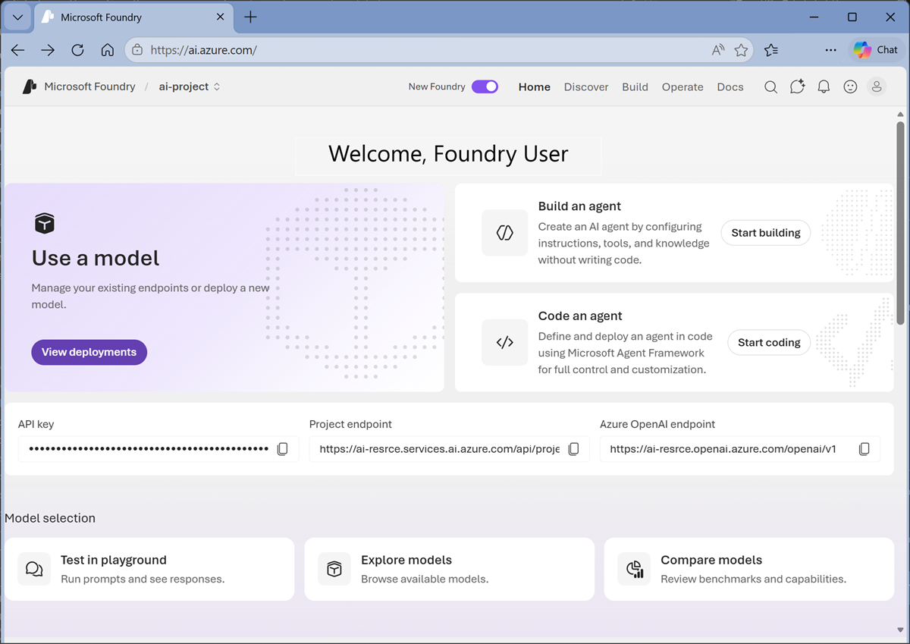
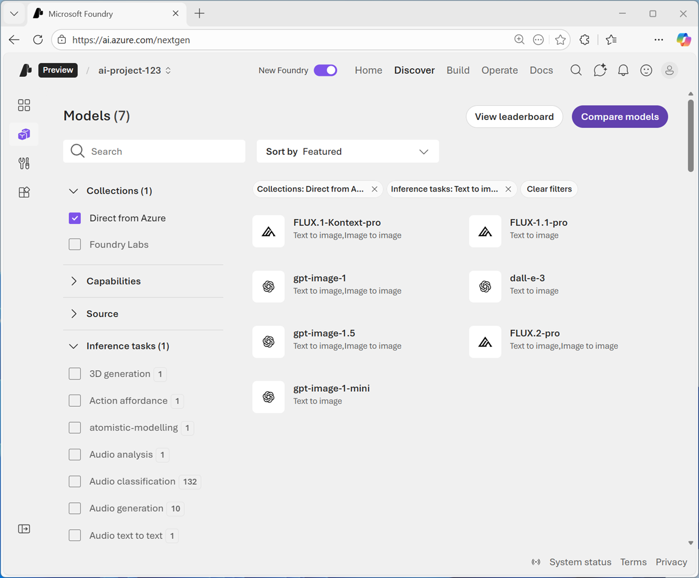
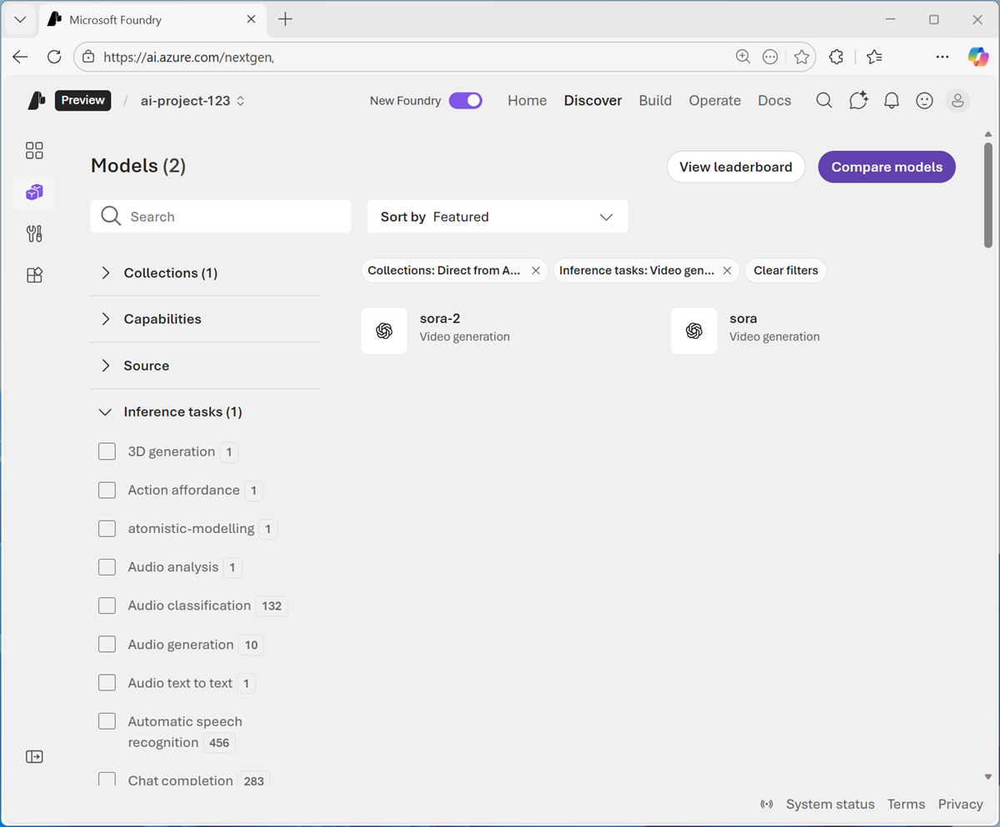

---
lab:
  title: Microsoft Foundry で Computer Vision の使用を開始する
  description: 生成 AI モデルを使って、ビジュアル データを解釈および生成します。
  level: 200
  duration: 30 minutes
  islab: true
  primarytopics:
    - Microsoft Foundry
---

# Microsoft Foundry で Computer Vision の使用を開始する

<br/>**こんにちは、Anton です。**<br/>このラボで、Microsoft Foundry の生成 AI モデルを使い、ビジュアル データを扱う手順を進められるよう、ヒントやコツを使ってサポートします。

より対話型のヘルプが必要な場合は、*[Ask Anton](https://aka.ms/choose-anton){:target="_blank"}* アプリで私とチャットできます。

<details>
<strong><i><a href="https://aka.ms/choose-anton" target="_blank">Ask Anton</a></i></strong> は、AI の概念や Microsoft Foundry の技術に関する質問に答えることができる生成 AI エージェントです。 <code>https://aka.ms/choose-anton</code> から、2 つのバージョンで使用できます。
<ul>
<li><strong>Azure ベースの</strong>: 最適なエクスペリエンスです (Azure サブスクリプションと Foundry プロジェクト内のモデルのデプロイが必要です)。<i></i></li>
<li><strong>ブラウザーベース</strong>: ブラウザーで小さな言語モデルを使用します (機能は制限されています。古い、または低スペックのデバイスでは動作が遅くなるか "ベーシック" モードでしか動作しないことがあります)。<i></i></li>
</ul>
<blockquote><i>Ask Anton は、サポートされている Microsoft 製品、Microsoft Learn、AI スキル ナビゲーターのコンポーネントのいずれでも<u>ありません</u>。</i>
</blockquote>
</details>
<hr/>

この演習の所要時間は約 **30** 分です。

## Microsoft Foundry プロジェクトを作成する

Microsoft Foundry では "プロジェクト" を使って、AI ソリューションの開発に使われるモデル、リソース、データ、その他の資産を整理します。**

1. Web ブラウザーで [Microsoft Foundry](https://ai.azure.com){:target="_blank"} (`https://ai.azure.com`) を開いてビルドを開始します。Azure の資格情報を使ってサインインします。
1. まだ有効になっていない場合は、ページ上部のツール バーで **[新しい Foundry]** オプションを有効にします。
1. 既存のプロジェクトがない場合は、プロジェクトを作成するようにダイアログが表示されます。 一意の名前で新しいプロジェクトを作成します。**[詳細オプション]** 領域を展開して、プロジェクトの次の設定を指定します (または、既存のプロジェクトがある場合は選択できます)。
    - **Foundry リソース**: *AI Foundry リソースに有効な名前を入力します。*
    - **[サブスクリプション]**:"*ご自身の Azure サブスクリプション*"
    - **リソース グループ**: *リソース グループを作成または選択します*
    - **リージョン**: [こちらの一覧](https://learn.microsoft.com/azure/foundry/openai/how-to/responses#supported-regions){:target="_blank"}にある、**AI Foundry の推奨**リージョンのいずれかを選択します

    > <br/>**ヒント**: Azure サブスクリプションのアクセス許可によっては、推奨されるリソースを設定するオプションをオフにする必要がある場合があります。

1. プロジェクトが作成されるまで待ちます。 これには数分かかることがあります。 "新しい" Foundry ポータルでプロジェクトを作成または選択すると、それが次の画像のようなページで開かれます。

    

## 生成 AI モデルを使って画像を分析する

Computer Vision のモデルを使うと、AI システムは画像ベースのデータ (写真、ビデオ、その他の視覚要素など) を解釈できます。 この演習では、エージェントでコンピューター ビジョンを使用して、古いコンピューター ハードウェアを識別する方法について説明します。

1. 新しいブラウザー タブで、**[images.zip](https://microsoftlearning.github.io/mslearn-ai-fundamentals/data/images.zip){:target="_blank"}** `https://microsoftlearning.github.io/mslearn-ai-fundamentals/data/images.zip` をローカル コンピューターにダウンロードします。
1. ダウンロードしたアーカイブをローカル フォルダーに抽出し、それに含まれるファイルを確認します。 これらのファイルは、AI を使って分析する画像です。
1. Microsoft Foundry プロジェクトが含まれるブラウザー タブに戻ります。
1. **[検出]** ページで **[モデル]** タブを選択して Microsoft Foundry モデル カタログを表示します。
1. `gpt-5-mini` モデルを検索し、既定の設定を使ってデプロイします。 デプロイには 1 分ほどかかる場合があります。

    > <br/>**ヒント**: 既に *gpt* モデル デプロイがある場合は、新しいモデルをデプロイせずにそれを使用できます。 モデルのデプロイにはリージョンのクォータが適用されます。 *gpt-5-mini* モデルをプロジェクトのリージョンにデプロイするのに十分なクォータがない場合は、別の *gpt* チャット対応モデル (*gpt-5-nano*、*gpt-5.4-mini* など) を使用できます。 あるいは、新しいプロジェクトを別のリージョンに作成することもできます。

1. モデルがデプロイされると開くモデル プレイグラウンド ページを確認します。ここでモデルとチャットできます。

    

1. 左側のナビゲーション ウィンドウの下部にあるボタンを使ってそれを非表示にし、作業するスペースを増やします。
1. 左側のペインで、**[指示]** を `You are an AI assistant that helps people identify vintage computer hardware.` に設定します
1. チャット ペインの **[画像のアップロード]** ボタンを使って、コンピューター上に抽出した画像のいずれかを選びます。 画像がプロンプト領域に追加されます。

1. `What can you tell me about this?` のようなプロンプト テキストを入力し、アップロードした画像とテキストの両方を含むプロンプトを送信します。
1. 応答を確認すると、アップロードした画像に関する情報が含まれているはずです。

    追加した画像を選んで表示できます。

   

1. `What is this?` や `Tell me about this.` などの他の画像を含むプロンプトを送信します

### コードの表示

モデルを使って画像を解釈できるクライアント アプリまたはエージェントを開発するには、OpenAI **Responses** API を使用できます。

1. **[チャット]** ペインで **[モデルの呼び出し]** タブを選択して、サンプル コードを表示します。
1. 次のコード オプションを選びます。
    - **言語**: Python
    - **認証**: キー認証

    既定のサンプル コードには、テキストベースのプロンプトのみが含まれています。 画像を分析するプロンプトを送信するには、次に示すように **input** パラメーターを変更して、テキストと画像の両方の内容を含めることができます。

    ```python
    from openai import OpenAI
    
    endpoint = "https://your-project-resource.openai.azure.com/openai/v1/"
    deployment_name = "gpt-5-mini"
    api_key = "<your-api-key>"
    
    client = OpenAI(
        base_url=endpoint,
        api_key=api_key
    )
    
    response = client.responses.create(
        model=deployment_name,
        input=[{
            "role": "user",
            "content": [
                {"type": "input_text", "text": "what's in this image?"},
                {"type": "input_image", "image_url": "https://an-online-image.jpg"},
            ],
        }],
    )
    
    print(f"answer: {response.output_text}")
    ```

    > <br/>**ヒント**: 職場または学校アカウントを使って Azure にサインインしていて、Azure サブスクリプションに十分なアクセス許可がある場合は、VS Code for Web でサンプル コードを開いて実行し、画像ベースの入力内容を試すことができます。 サービスの **key** は、(サンプル コードの上にある) モデル のプレイグラウンドの **Code** タブで取得できます。また、画像 **[joystick.png](https://microsoftlearning.github.io/mslearn-ai-fundamentals/data/joystick.png){:target="_blank"}** を `https://microsoftlearning.github.io/mslearn-ai-fundamentals/data/joystick.png`で使用できます。 OpenAI API を使用した画像の分析について詳しくは、[OpenAI のドキュメント](https://platform.openai.com/docs/guides/images-vision#analyze-images)をご覧ください。

## 生成 AI モデルを使って新しい画像を作成する

ここまでは、視覚的な入力を処理する生成 AI モデルの機能を調べてきました。 ここでは、コンピューティング履歴エージェントをサポートするための適切な画像を Web サイト上に置きたいものとします。 モデルで視覚的な出力を生成する方法を見てみましょう。

> <br/>**ヒント**: このタスクを実行するには、画像生成モデルにアクセスできるサブスクリプションが必要です。

1. **gpt-5-mini** ヘッダーの横にある "戻る" 矢印を使って (またはナビゲーション ウィンドウで **[モデル]** ページを選んで)、プロジェクトでのモデル デプロイを表示します。
1. **[基本モデルをデプロイする]** を選んでモデル カタログを開きます。
1. **[コレクション]** ドロップダウン リストで **[Direct from Azure]** を選び、**[推論タスク]** ドロップダウン リストで **[テキストから画像]** を選びます。 次に、画像生成に使用できるモデルを表示します。

   

    > <br/>**ヒント**: サブスクリプションで使用できるモデルは異なる場合があります。 さらに、モデルをデプロイする機能は、リージョンでの使用可能性とクォータによって異なります。

1. **gpt-image-1-mini** や **FLUX.2-pro** など、使用可能なテキストから画像への変換モデルを選択してデプロイします。

    "これらのモデルのいずれかがサブスクリプションまたは Azure リージョンで使用できない場合は、使用可能な別のテキストから画像への変換モデルをデプロイします。"**

1. モデルがデプロイされると、画像プレイグラウンドでそれが開きます。
1. 目的の画像を説明するプロンプトを入力します (例: `A vintage PC with a CRT monitor.`)。生成された画像を確認します。

   

### コードの表示

モデルを使って画像を生成するクライアント アプリまたはエージェントを開発したい場合は、OpenAI API を使用できます。

> <br/>**ヒント**: モデルの可用性とプレイグラウンドの機能は異なる場合があります。 一部の画像生成モデルでは、**[コードの表示]** または同等のオプションが表示されない場合があります。 選択したモデルにコード サンプルが含まれていない場合でも、プレイグラウンドで画像を生成して演習を完了するか、コード サンプルを公開する別のデプロイされたテキストからイメージへの変換モデルを使用できます。

1. デプロイされたモデルにサンプル コードが含まれている場合は、**[チャット]** ペインで **[コードの表示]** タブを選択して、サンプル コードを表示します。
1. 次のコード オプションを選びます。
    - **言語**: Python
    - **SDK**:OpenAI SDK
    - **認証**: キー認証

    既定のサンプル コードは次のようになります。

    ```python
    import base64
    from openai import OpenAI
    
    endpoint = "https://your-project-resource.openai.azure.com/openai/v1/"
    deployment_name = "your-text-to-image-model-deployment"
    api_key = "<your-api-key>"
    
    client = OpenAI(
        base_url=endpoint,
        api_key=api_key
    )
    
    img = client.images.generate(
        model=deployment_name,
        prompt="A cute baby polar bear",
        n=1,
        size="1024x1024",
    )
    
    image_bytes = base64.b64decode(img.data[0].b64_json)
    with open("output.png", "wb") as f:
        f.write(image_bytes)
    ```

## 生成 AI モデルを使って動画を作成する (使用できる場合)**

<br/>**ヒント**: このタスクを実行するには、動画生成モデルにアクセスできるサブスクリプションが必要です。

静的な画像に加えて、コンピューティング履歴エージェントの Web サイトにビデオ コンテンツを含めることができます。

1. 画像生成モデルのヘッダーの横にある "戻る" 矢印を使って (またはナビゲーション ウィンドウで **[モデル]** ページを選んで)、プロジェクトでのモデル デプロイを表示します。
1. **[基本モデルをデプロイする]** を選んでモデル カタログを開きます。
1. **[コレクション]** ドロップダウン リストで **[Direct from Azure]** を選び、**[推論タスク]** ドロップダウン リストで **[ビデオ生成]** を選びます。 次に、ビデオ生成に使用できるモデルを表示します。

   

    <br/>**ヒント**: サブスクリプションで使用できるモデルは異なる場合があります。 さらに、モデルをデプロイする機能は、リージョンでの使用可能性とクォータによって異なります。

1. **Sora-2** モデルを選んでデプロイします。

    サブスクリプションに Sora-2 モデルが含まれている場合、利用可能な最新モデルへのアクセスの依頼が必要になる場合があります。**

1. モデルがデプロイされると、ビデオ プレイグラウンドでそれが開きます。
1. 目的の動画を説明するプロンプトを入力します (例: `A retro computer game.`)。生成された動画を確認します。

   

### コードの表示

モデルを使ってビデオを生成するクライアント アプリまたはエージェントを開発したい場合は、REST API を使用できます。

1. **[チャット]** ペインで **[コードの表示]** を選択して、サンプル コードを表示します。

    既定のサンプル コードでは、*curl* コマンドを使って REST エンドポイントが呼び出されます。次のようになります。

    ```bash
    curl -X POST "https://your-project-resource.openai.azure.com/openai/v1/video/generations/jobs" \
    -H "Content-Type: application/json" \
    -H "Authorization: Bearer $AZURE_API_KEY" \
    -d '{
        "prompt" : "A video of a cat",
         "height" : "1080",
         "width" : "1080",
         "n_seconds" : "5",
         "n_variants" : "1",
        "model": "sora"
        }'
    ```

## まとめ

この演習では、視覚データを入力として受け入れることができるモデル、テキストの説明に基づいて静的な画像を生成できるモデル、ビデオを生成できるモデルなど、Microsoft Foundry でのビジョン対応モデルの使用について調べました。

## クリーンアップ

Microsoft Foundry での作業が完了したら、不要な Azure コストが発生しないように、この演習で作成したリソースを削除します。

1. [https://portal.azure.com](https://portal.azure.com) で **Azure portal** を開き、作成したリソースを含むリソース グループを選択します。
1. **[リソース グループの削除]** を選び、**リソース グループの名前を入力**して、確定します。 これでリソース グループが削除されます。

> <br/>このラボで [*Ask Anton*](https://aka.ms/choose-anton){:target="_blank"} アプリを使用した場合は、[そのエクスペリエンスについてお聞かせください。](https://forms.office.com/r/fC0ndfBQeK){:target="_blank"}
