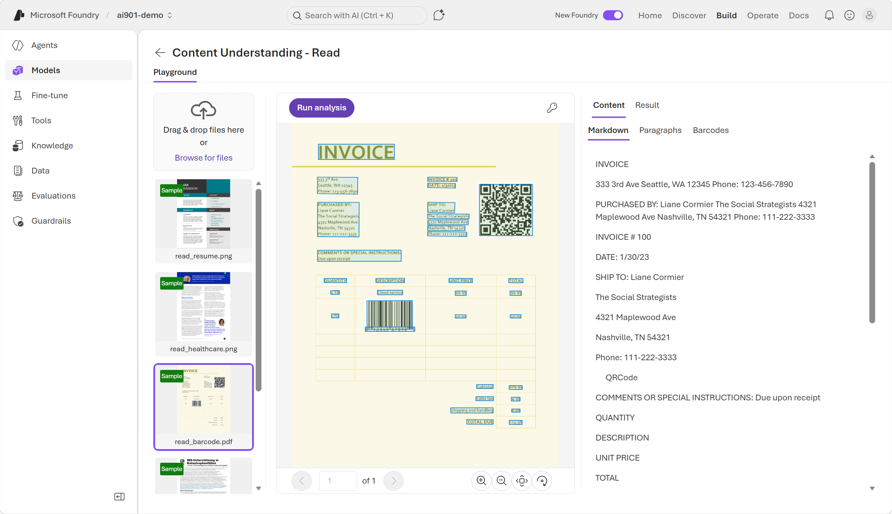
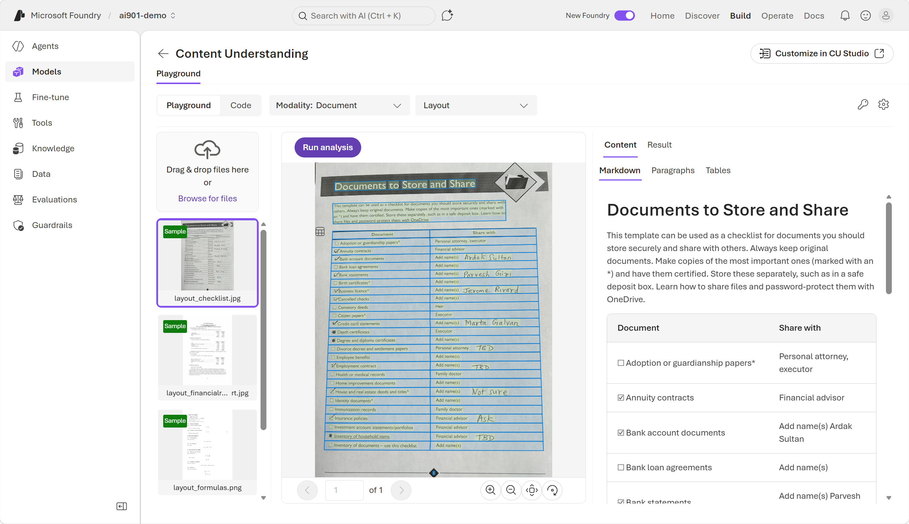
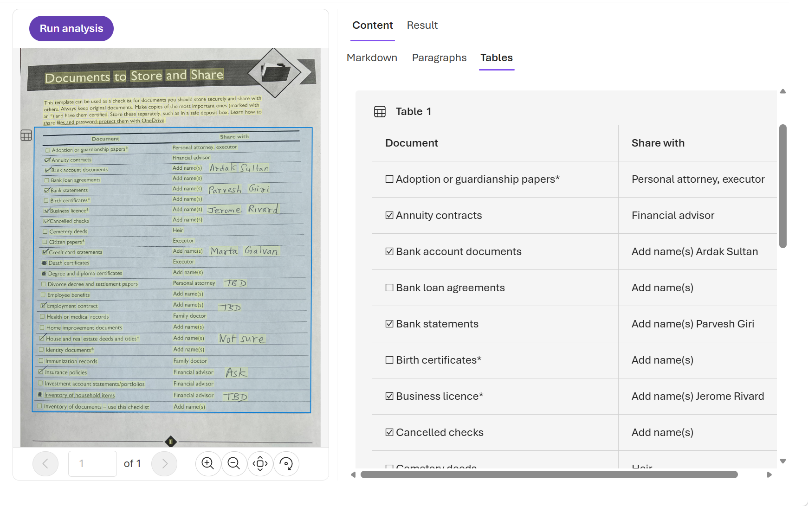
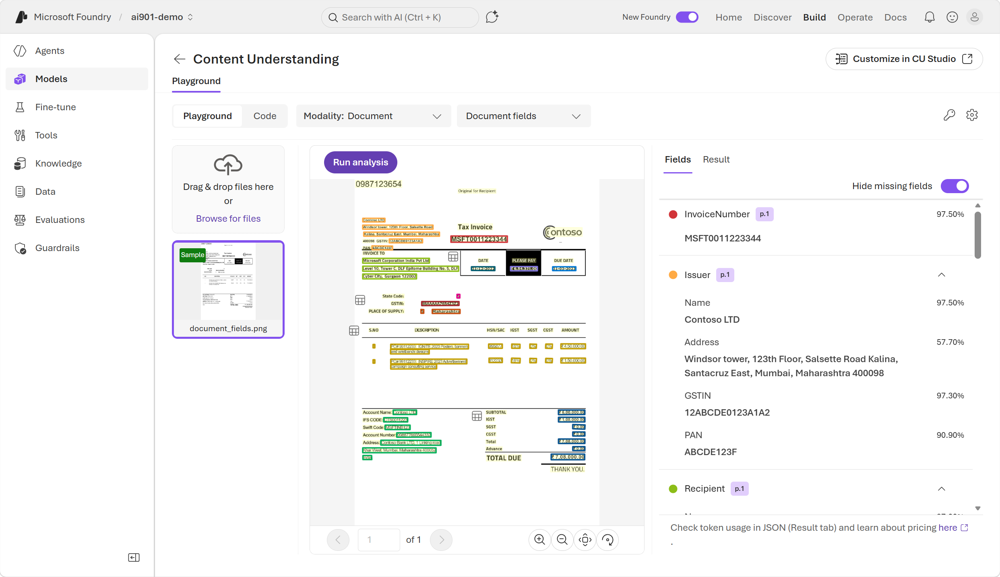
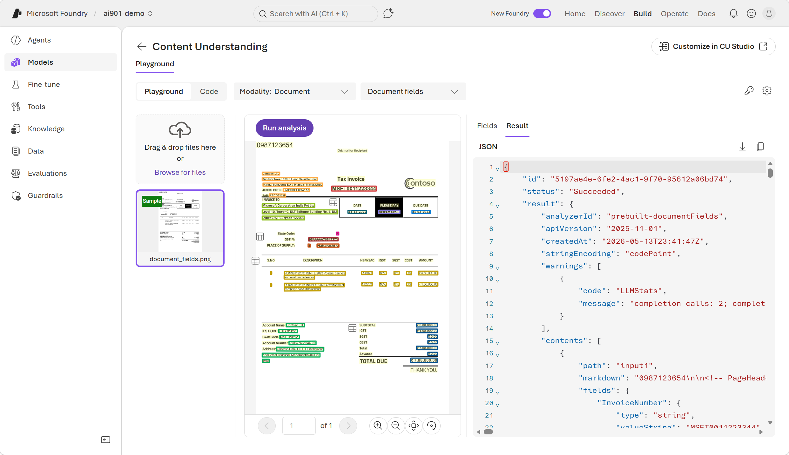
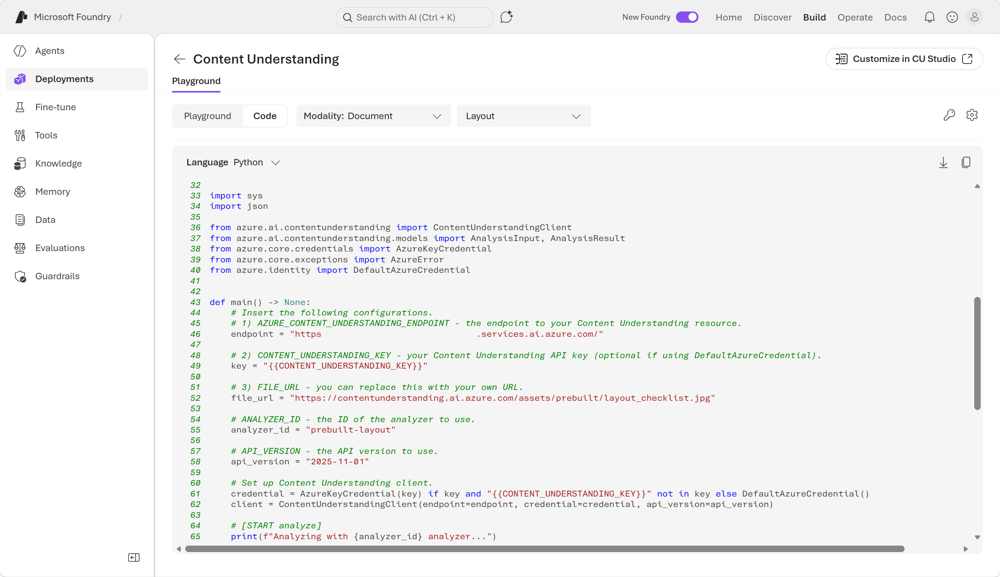

---
lab:
  title: Microsoft Foundry での情報抽出に関する概要
  description: AI モデルを使用して、ビジュアル データから情報を抽出します。
  level: 200
  duration: 25 minutes
  islab: true
  primarytopics:
    - Microsoft Foundry
---

# Microsoft Foundry での情報抽出に関する概要

この演習では、インテリジェント アプリケーションを作成するための Microsoft のプラットフォームである Foundry で、Azure Content Understanding を使用します。

Azure Content Understanding は Foundry サービスの 1 つであり、AI モデルを使用して、構造化されていないマルチモーダル コンテンツ (ドキュメント、画像、ビデオ、オーディオ) を JSON などの構造化された使用可能な出力に変換します。 信頼度スコアとソースの典拠を使用してフィールドの抽出、分類、生成を行って、コンテンツを処理します。

この演習の所要時間はおよそ **25** 分です。

>**注**: この演習では、"新しい" Foundry ポータルのエクスペリエンスを利用します。**

## Microsoft Foundry プロジェクトを作成する

1. Web ブラウザーで [Microsoft Foundry](https://ai.azure.com){:target="_blank"} (`https://ai.azure.com`) を開いてビルドを開始します。Azure の資格情報を使ってサインインします。

2. まだ有効になっていない場合は、ページ上部のツール バーで **[新しい Foundry]** オプションを有効にします。 次に、メッセージが表示されたら、一意の名前で "新しいプロジェクト" を作成し、**[高度なオプション]** 領域を展開して、プロジェクトの設定を次のとおりに指定します。**
    - **Foundry リソース**: *AI Foundry リソースに有効な名前を入力します。*
    - **[サブスクリプション]**:"*ご自身の Azure サブスクリプション*"
    - **リソース グループ**: *リソース グループを作成または選択します*
    - **リージョン**: [米国西部]、[スウェーデン中部]、[オーストラリア東部]、または**[こちらの一覧](https://learn.microsoft.com/azure/ai-services/content-understanding/language-region-support)** のいずれかのリージョンを選択します {:target="_blank"}******

3. [推奨リソースを設定して...] オプションの選択を解除します。次に、**[作成]** を選択します。**

    ![[推奨リソースを設定して...] オプションが選択解除されている [プロジェクトの作成] ページのスクリーンショット。](./media/create-new-project.png)

4. プロジェクトが作成されるまで待ちます。 これには数分かかることがあります。 "新しい" Foundry ポータルでプロジェクトを作成または選択すると、それが次の画像のようなページで開かれます。**

    

## 新しい Foundry ポータルでドキュメントから情報を抽出する

1. Foundry ポータルで画面の上部にあるツール バーに移動し、**[ビルド]** を選択します。
2. *[ビルド]* ページで、画面の左側のメニュー (展開が必要な場合があります) で、**[デプロイ]** を選択します。 次に、[デプロイ] ページの上部にある **[AI サービス]** を選択します。**
3. Foundry プレイグラウンドの設定で試すことができる **Content Understanding** 機能を確認します。
   - "Content Understanding - 読み取り": 生テキストの抽出のみ。** "ここにどんなテキストがありますか" という質問に答えます。
   - "Content Understanding - レイアウト": 構造、階層、配置を追加します。** "このコンテンツはどのように整理されていますか" という質問に答えます。
   - *Content Understanding*: フィールドと構造を抽出し、分析情報を生成して、完全なアナライザー機能を提供します。 "このコンテンツは何を意味し、どのように扱えばよいのでしょうか" という質問に答えます。

#### Content Understanding の "読み取り" 機能を試す**

1. **[Content Understanding - 読み取り]** を選択します。 "読み取り" 機能は、コンテンツの解釈の最初のステップであり、テキストの読み取りと抽出を行いますが、まだ構造や意味を理解しようとはしません。**

2. サンプルの **[read_barcode.pdf]** を選択し、**[分析の実行]** ボタンを使用して情報をドキュメントから抽出します。 分析が完了したら、結果を表示します。

    

3. [戻る] ボタンを選択して前のページに戻り、他の機能をテストします。

#### Content Understanding の "レイアウト" 機能を試す**

1. [AI サービス] タブで、**[Content Understanding - レイアウト]** を選択します。**

2. サンプルの **[layout_checklist.jpg]** を選択し、**[分析の実行]** ボタンを使用して、そこから情報を抽出します。 分析が完了したら、結果を表示します。

    

3. コンテンツ出力で、**[テーブル]** タブを選択します。"レイアウト" アナライザーでコンテンツのテキストと構造の両方をどのようにキャプチャできるかを確認します。**

    

4. [戻る] ボタンを選択して前のページに戻り、他の機能をテストします。

#### Content Understanding の他のアナライザー機能を試す

1. [AI サービス] タブで **[Content Understanding]** を選択して、別の Azure Content Understanding アナライザーをテストします。**

2. [Content Understanding] ページで、**[ドキュメント]** モダリティを選択します。**

    ![[ドキュメント モダリティ] が選択されている完全なアナライザーのスクリーンショット。](./media/full-content-analzyer-document.png)

3. [ドキュメント] モダリティの横にあるドロップダウン メニューから [ドキュメント フィールド] を選択します。**** まだ構成されていないモデルをデプロイするように求められた場合は、**[モデルのデプロイ]** を選択します。

    >**ヒント**: "ドキュメント フィールド" およびその他の複雑な抽出ニーズでは、各デプロイが特定のモデルのバージョンまたは機能に関連付けられているため、複数の AI モデルをデプロイする必要があります。** Azure AI Foundry で複数のモデルを使用すると、さまざまな種類の処理タスクをより効果的に処理でき、各ニーズに適したモデルを柔軟に選択できます。

4. ドロップダウン メニューから推奨される [チャットの入力候補モデル] と [埋め込みモデル] を選択します。**** 次に、**[変更の適用]** を選択します。 変更が適用されたら、[構成] パネルを閉じます。**

5. 自身の請求書で完全なアナライザーを使用してみましょう。 新しいブラウザー ウィンドウを開きます。 URL `https://raw.githubusercontent.com/MicrosoftLearning/mslearn-ai-fundamentals/refs/heads/main/data/content-understanding/contoso-invoice-1.pdf` を入力して、**[contoso-invoice-1.pdf](https://raw.githubusercontent.com/MicrosoftLearning/mslearn-ai-fundamentals/refs/heads/main/data/content-understanding/contoso-invoice-1.pdf){:target="_blank"}** をダウンロードします。

6. **[ファイルの参照]** リンクを使用して、先ほどダウンロードした **contoso-invoice-1.pdf** ドキュメントをアップロードします。 **[分析の実行]** を選択し、結果を確認します。 テキストがレンダリングされるだけでなく、そのレイアウトもキャプチャされ、フィールドがまとまりのあるカテゴリに整理されていることに注意してください。  

    

7. 抽出されたフィールドが表示されている右側のペインで、**[結果]** タブを表示すると、JSON 形式の生の結果が表示されます。 **analyzerID** フィールドを確認します。このフィールドには、使用されたアナライザーの種類が含まれています。 事前構築済みの Content Understanding アナライザーの一覧については、[こちら](https://learn.microsoft.com/azure/ai-services/content-understanding/concepts/prebuilt-analyzers)を参照してください。

     

>**ヒント**: [フィールド] タブには、[結果] タブの生の JSON データから得られた情報が、ユーザー フレンドリな形式で表示されると考えてください。****

## REST API を使用してコンテンツを抽出する方法を理解する

1. 開発者は REST API を使用して、POST 操作を使用して Content Understanding アナライザーに分析対象のドキュメントを送信するアプリを構築できます。 たとえば、請求書を分析するには次のような cUrl コマンドを使用します。

    ```bash
   curl -i -X POST "{endpoint}/contentunderstanding/analyzers/{analyzerId}:analyze?api-version=2025-11-01" \
      -H "Ocp-Apim-Subscription-Key: {key}" \
      -H "Content-Type: application/json" \
      -d '{
            "inputs":[
              {
                "url": "https://{url_path}/invoice.png"
              }          
            ]
          }'
    ```

1. cUrl コマンドで何を指定する必要があるかを考えてみましょう。
   - *analzyerID*
   - *endpoint*
   - *キー*
   - ドキュメントへの *url_path*

1. コマンドを実行すると、応答が JSON 形式で返されます。 分析は非同期で実行されるため、応答には、次のように分析ジョブ固有の **id** 値が含まれており、結果をポーリングするために使用することができます。

    ```json
   {
      "id": {resultId},
      "status": "Running",
      "result": {
        "analyzerId": {analyzerId},
        "apiVersion": "2025-11-01",
        "createdAt": "YYYY-MM-DDTHH:MM:SSZ",
        "warnings": [],
        "contents": []
      }
    }
    ```

>**ヒント**: 非同期呼び出しでの結果のポーリングは、操作が完了して最終的な結果が得られるまで、要求の状態を一定間隔で繰り返し確認することを意味します。 この場合の最終的な結果は、分析が完了することです。 結果が返されたら、別の呼び出しを行って結果を取得する必要があります。

1. ID を使用して結果を取得するには、次のようにクライアントから GET 要求を送信する必要があります。

    ```bash
   curl -i -X GET "{endpoint}/contentunderstanding/analyzerResults/{resultId}?api-version=2025-11-01" \
      -H "Ocp-Apim-Subscription-Key: {key}"
    ```

1. cUrl コマンドで何を指定する必要があるかを考えてみましょう。
   - *resultID*
   - *endpoint*
   - *キー*

## Python SDK を使用してコンテンツを抽出する方法を理解する

1. また、開発者は、コードを使用して分析対象のドキュメントを "ドキュメント フィールド" アナライザーに送信することもできます。** Foundry プレイグラウンドにはコード サンプルが用意されています。 **[コード]** タブを選択して、この応答を処理し、抽出されたフィールドを利用するために使用できるコードを確認します。

    

## まとめ

この演習では、Foundry の Azure Content Understanding を調べ、非構造化コンテンツを構造化された使用可能なデータに変換する方法について学習しました。 各アナライザーを前のアナライザーの機能を基に構築し、次の 3 つのアナライザーを試しました。

- **読み取り**: 構造や意味を解釈することなく、ドキュメントから生のテキストを抽出します。"ここにはどんなテキストがありますか" という質問に答えます。
- **レイアウト**: 構造、階層、配置 (テーブルを含む) をキャプチャしてさらに一歩進みます。"このコンテンツはどのように構成されているか" という質問に答えます。
- **ドキュメント フィールド**: 機能の組み合わせを使用してフィールドを抽出し、それらをまとまりのあるカテゴリに整理し、分析情報を生成するアナライザー。"このコンテンツは何を意味し、どのように扱えばよいのでしょうか" という質問に答えます。 このような Content Understanding アナライザーでは、複雑な抽出のニーズに対応するために、追加の AI モデル (チャット入力候補モデルや埋め込みモデルなど) のデプロイが必要になる場合があります。

また、開発者が、**REST API** を使用するか (POST 要求を介してドキュメントを送信し、GET 要求で結果をポーリングする)、または **Python SDK** を使用してアプリケーションに Content Understanding を統合する方法についても学習しました。どちらを使用する場合も、Foundry プレイグラウンドの外部にあるドキュメントをプログラムで分析できます。

> **[Ask Anton](https://aka.ms/azk-anton){:target="_blank"}**<br/><br/>この演習で取り上げるいくつかのトピックについて疑問がある場合、*[Ask Anton](https://aka.ms/azk-anton){:target="_blank"}* は生成 AI ベースのエージェントであり、AI の概念や Microsoft Foundry について質問することができます。 **[https://aka.ms/azk-anton](https://aka.ms/azk-anton){:target="_blank"}** でアプリを開き、**[構成]** ボタンを使用して Foundry プロジェクトとモデルの詳細を入力します。<br/><br/>"Ask Anton は、サポートされる Microsoft 製品ではなく、Microsoft Learn や AI スキル ナビゲーターのコンポーネントでもありません。AI で何が可能であるかを学ぶ際に探求できる AI エージェントの一例にすぎません。"**<br/><br/>Ask Anton をお試しいただき、"そのご感想をぜひ[こちらのフォーム](https://forms.office.com/r/fC0ndfBQeK){:target="_blank"}にてお寄せください"。****

## クリーンアップ

コンテンツ解釈サービスの操作が終わったら、不要な Azure コストが発生しないように、この演習で作成したリソースを削除する必要があります。

- Azure portal において、この演習で作成したリソース グループを削除します。
