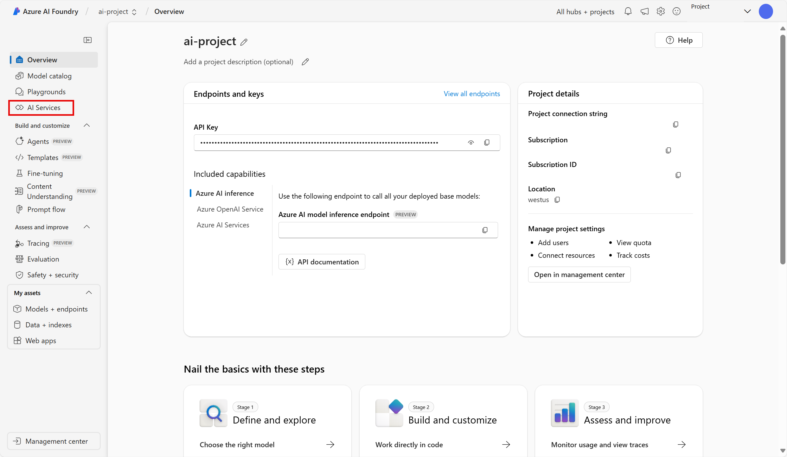

---
lab:
  title: Azure AI Foundry ポータルでコンテンツ解釈を使用してデータを抽出する
---

# Azure AI Foundry ポータルでコンテンツ解釈を使用してデータを抽出する

**Azure AI コンテンツ解釈 (プレビュー)** は生成 AI を使用して、様々な種類のコンテンツ (ドキュメント、画像、ビデオ、オーディオ) を処理してユーザー定義の出力形式に取り込みます。

この演習では、インテリジェント アプリケーションを作成するための Microsoft のプラットフォーム、Azure AI Foundry ポータルで、Azure AI コンテンツ解釈を使用して、請求書のデータを認識します。 

この演習の所要時間はおよそ **25** 分です。

## Azure AI Foundry プロジェクトを作成する

まず、Azure AI Foundry プロジェクトを作成します。

1. Web ブラウザーで [Azure AI Foundry ポータル](https://ai.azure.com) (`https://ai.azure.com`) を開き、Azure 資格情報を使用してサインインします。 初めてサインインするときに開いたヒントまたはクイック スタート ウィンドウを閉じます。また、必要に応じて左上にある **Azure AI Foundry** ロゴを使用してホーム ページに移動します。それは次の画像のようになります (**[ヘルプ]** ウィンドウが開いている場合は閉じます)。

    

1. ホーム ページで、**[+ 作成]** を選択します。

1. **[プロジェクトの作成]** ウィザードで、プロジェクトの有効な名前を入力し、既存のハブが推奨される場合は、新しいハブを作成するオプションを選択します。 次に、ハブとプロジェクトをサポートするために自動的に作成される Azure リソースを確認します。

1. **[カスタマイズ]** を選択し、ハブに次の設定を指定します。
    - **ハブ名**: *ハブの有効な名前*
    - **[サブスクリプション]**:"*ご自身の Azure サブスクリプション*"
    - **リソース グループ**: *リソース グループを作成または選択します*
    - **[場所]** :米国西部 
    - **Azure AI サービスまたは Azure OpenAI への接続**: *新しい AI サービス リソースを作成します*
    - **Azure AI 検索への接続**:接続をスキップする

1. **[次へ]** を選択し、構成を確認します。 **[作成]** を選択し、プロセスが完了するまで待ちます。

1. プロジェクトが作成されたら、表示されているヒントをすべて閉じて、Azure AI Foundry ポータルのプロジェクト ページを確認します。これは次の画像のようになっているはずです。

    
 
1. 画面左側のメニューに移動します。 次に、**[AI サービス]** を選択します。

1. *[AI サービス]* ページで、*[コンテンツの解釈]* タイルを選択して、Azure AI コンテンツ解釈の機能を試します。

## Azure AI Foundry の Azure AI コンテンツ解釈を使用した請求書を分析する 

多くの請求書からデータを抽出し、そのデータをデータベースに保存するとします。 Azure AI コンテンツ解釈を使用して、1 つの請求書を分析し、他の類似した請求書を分析できる独自のアナライザーを構築することができます。 まず、コンテンツの解釈のタスクを作成しましょう。

![[コンテンツの解釈] のメイン ページのスクリーンショット。](./media/content-understanding/content-understanding-1.png)

1. **[カスタム アナライザー]** を選択します。 

1. **[+ 作成]** を選択し、次の設定を使用してコンテンツの解釈のタスクを作成します。
    - **タスク名**: contoso-invoice
    - **説明**: 請求書分析タスク
    - **Azure AI サービス接続**: *既定値を使用します*
    - **Azure Blob Storage アカウント**: *既定値を使用します*

1. **[作成]** を選択して、アプリが作成されるまで待ちます。 
1. **[contoso-invoice]** タスクを選択します。 

#### スキーマの定義 

1. *[スキーマの定義]* ページで、テスト ファイルを追加できます。 `https://raw.githubusercontent.com/MicrosoftLearning/mslearn-ai-fundamentals/refs/heads/main/data/contoso-invoice-1.pdf` から [contoso-invoice-1.pdf](https://raw.githubusercontent.com/MicrosoftLearning/mslearn-ai-fundamentals/refs/heads/main/contoso-invoice-1.pdf) をダウンロードします。 

1. ファイルを *[スキーマの定義]* ページにアップロードします。 *[請求書の分析]* テンプレートを選択します。 請求書テンプレートには、アナライザーが検出しようとするデータ フィールドがあらかじめ選択されています。 

    ![コンテンツ解釈ツールの [スキーマの定義] ページのスクリーンショット。](./media/content-understanding/define-schema.png)

1. **［作成］** を選択します これで、フィールドを追加または削除してスキーマを変更できるようになりました。 フィールドの確認が完了したら、**[保存]** を選択します。

    ![作成を選択した後の [スキーマの定義] ページのスクリーンショット。](./media/content-understanding/define-schema-2.png)

1. 分析が実行されるまで待機します。 これには少し時間がかかることがあります。

#### アナライザーをテストする 

1. 分析が完了すると、*[アナライザーのテスト]* ページでアナライザーがどのように行われたかを確認できます。 *[フィールド]* タブを確認します。このデータは請求書に表示されているデータと一致していますか? 
    ![フィールドの結果タブが強調表示されている [アナライザーのテスト] ページのスクリーンショット。](./media/content-understanding/test-analyzer-fields.png)

1. 各フィールドの横に*信頼度スコア*があります。 信頼度スコアは、モデルの結果がどれくらい正確であるかについての信頼度を表します。 結果の信頼度スコアが 100% に近い場合は、予測の信頼度が高いことを示します。
1. *[結果]* タブを確認します。[フィールド] タブに表示されている情報が JSON の結果タブにも表示されています。 JSON は、情報がクライアント・アプリケーションとの間でどのように送受信されるのかを示しています。 

    ![[結果] タブが強調表示されている [アナライザーのテスト] ページのスクリーンショット。](./media/content-understanding/test-analyzer-result.png)

1. コンテンツ解釈サービスは、スキーマ内のフィールドに対応するテキストを正しく識別している必要があります。 そうなっていない場合は、*[ラベル データ]* ページを使用して別のサンプル フォームをアップロードし、各フィールドの正しいテキストを明示的に識別することができます。 アナライザーによる請求書データの検出レベルに満足したら、**[アナライザーのビルド]** タブを選択します。 

#### アナライザーをビルドする 

サンプル請求書からフィールドを抽出するモデルのトレーニングが完了したので、類似したフォームで使用するアナライザーをビルドすることができます。 アナライザーをビルドすることで、モデルをデプロイし、それを他の請求書タスクの自動化に使用することができます。

1. *[アナライザーのビルド]* タブで、**[+ アナライザーのビルド]** を選択します。 次のように入力します。 
    - **名前**: invoice-analyzer
    - **説明**: 請求書アナライザー

    ![[アナライザーのビルド] ページのスクリーンショット。](./media/content-understanding/build-analyzer.png)

1. **ビルド**を選択します。 新しいアナライザーの準備が整うのを待ちます ([最新の情報に更新] ボタンで確認できます)。 アナライザーは、前の手順で定義およびテストしたスキーマに基づく予測モデルを使用します。 
1. 次に、ビルドしたアナライザーをテストしてみましょう。 `https://raw.githubusercontent.com/MicrosoftLearning/mslearn-ai-fundamentals/refs/heads/main/data/contoso-invoice-2.pdf` から Contoso [contoso-invoice-2.pdf](https://raw.githubusercontent.com/MicrosoftLearning/mslearn-ai-fundamentals/refs/heads/main/data/contoso-invoice-2.pdf) の別の請求書をダウンロードします。
1. *[アナライザーのビルド]* ページに戻り、invoice-analyzer リンクを選択します。 アナライザーのスキーマで定義されているフィールドが表示されます。
1. invoice-analyzer ページで、*[テスト]* を選択します。
1. **[+ テスト ファイルのアップロード]** ボタンを使用して、*contoso-receipt-2.pdf* をアップロードします。 **[分析の実行]** を選択して、テスト フォームからフィールド データを抽出します。 テストの実行結果を確認します。

    

1. *[コード例]*] タブを選択します。コードから*エンドポイント*を探します。 プロセスの *アナライザーのビルド* フェーズでは、コンテンツ解釈モデルをエンドポイントにデプロイしました。 このエンドポイントを例に示すようなコードの中で使用して、アプリケーションの反復可能なプロセスにモデルを組み込むことができます。  

    

## クリーンアップ

コンテンツ解釈サービスの操作が終わったら、不要な Azure コストが発生しないように、この演習で作成したリソースを削除する必要があります。

- Azure AI Foundry ポータルで、contoso-receipt プロジェクトに移動して削除します。
- Azure portal において、この演習で作成したリソース グループを削除します。